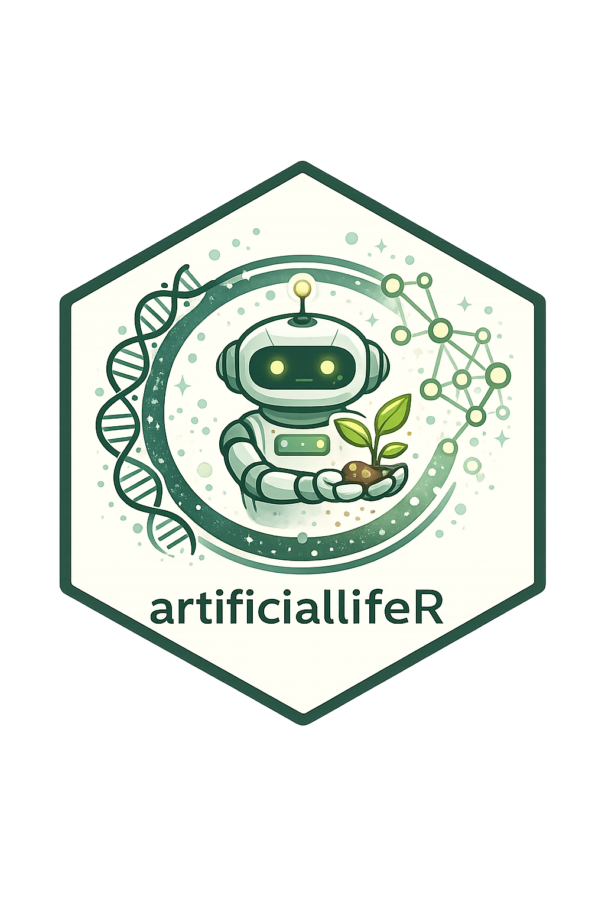

# artificialLifeR

[](https://www.r-project.org/)
[](LICENSE)
[](https://noushinn.github.io/artificialLifeR/)
<!-- badges: start -->
[](https://doi.org/10.5281/zenodo.20764171)
<!-- badges: end -->
[](https://github.com/NoushinN/artificialLifeR)

**artificialLifeR** is an educational R package for simulating, visualizing, and explaining simplified artificial-life models.

The package focuses on agents, resources, reproduction, mutation, selection, population dynamics, and life-like organization. It combines R functions, core tutorials, and a detailed theory guide to help learners explore how life-like patterns can arise from local interaction, variation, inheritance, and environmental constraints.

## Overview

Artificial life studies how life-like processes can be modeled, simulated, and understood using artificial systems. These systems may include agents, cellular automata, evolving populations, digital organisms, or simplified ecological worlds.

`artificialLifeR` is designed for teaching, conceptual exploration, science communication, and academic portfolio development.

The central idea is:

> Life-like organization can be explored through simplified models of agents, resources, reproduction, mutation, selection, and population change.

## Main features

The package provides educational toy simulations for:

- agent creation and variation;
- resource competition;
- reproduction and inheritance;
- mutation and trait variation;
- selection and fitness-based survival;
- population dynamics;
- life-like complexity summaries;
- visualization of artificial-life outputs.

## Important note

This package **does not fully model real biological life, real evolution, real ecosystems, real cognition, or consciousness**.

The models are simplified educational abstractions. They are designed to help users understand concepts such as agents, resources, traits, reproduction, mutation, selection, adaptation, and population-level change.

It is better to say:

> The simulations illustrate life-like dynamics in simplified artificial systems.

than:

> The simulations create or fully explain life.

## Installation

You can install the development version from GitHub:

```r
if (!requireNamespace("remotes", quietly = TRUE)) {
  install.packages("remotes")
}

remotes::install_github("NoushinN/artificialLifeR")
```

Then load the package:

```r
library(artificialLifeR)
```

## Quick example

Create a population of simple agents:

```r
library(artificialLifeR)

agents <- create_agents(
  n_agents = 50,
  seed = 1
)

head(agents)
```

Simulate resource competition:

```r
competition <- simulate_resource_competition(
  n_agents = 50,
  steps = 40,
  resource_regen = 0.20,
  seed = 2
)

head(competition)
```

Plot average energy over time:

```r
summary_energy <- aggregate(
  energy ~ step,
  data = competition$agents,
  FUN = mean
)

plot_alife_sim(
  summary_energy,
  x = "step",
  y = "energy",
  type = "line"
)
```

Summarize life-like complexity:

```r
measure_life_like_complexity(
  competition$agents,
  trait_col = "energy",
  time_col = "step"
)
```

## Package structure

| Section | Purpose |
|---|---|
| **Reference** | Formal documentation for each R function |
| **Core Tutorials** | Step-by-step examples showing how to run, visualize, compare, and interpret simulations |
| **Theory Guide** | Deeper conceptual chapters explaining artificial life, agents, resources, reproduction, mutation, selection, complexity, and responsible use |

## Core functions

| Function | Purpose |
|---|---|
| `create_agents()` | Creates a simple artificial population with traits and energy |
| `simulate_resource_competition()` | Simulates agents competing for spatially distributed resources |
| `simulate_reproduction()` | Simulates reproduction based on energy and inheritance |
| `simulate_mutation()` | Applies mutation to numeric traits |
| `simulate_selection()` | Applies fitness-based selection to a population |
| `simulate_population_dynamics()` | Simulates population change under birth, death, resources, and mutation |
| `measure_life_like_complexity()` | Computes simple diversity, entropy, variability, and temporal-change summaries |
| `plot_alife_sim()` | Visualizes artificial-life simulation outputs |

## Core tutorials

The Core Tutorials provide practical, code-focused walkthroughs.

They show how to:

- create agents;
- simulate resources and competition;
- simulate reproduction and mutation;
- simulate selection;
- simulate population dynamics;
- summarize outputs with `measure_life_like_complexity()`;
- visualize model outputs;
- interpret simulations responsibly.

## Theory guide

The Theory Guide provides deeper conceptual background for the package.

It explains topics such as:

- what artificial life is;
- agents, environments, and local rules;
- resources, metabolism, and constraint;
- reproduction and inheritance;
- mutation, variation, and novelty;
- selection and adaptation;
- population dynamics;
- artificial life, emergence, and origin-of-life research;
- artificial life and consciousness debates;
- limitations and responsible use.

## Suggested use

This package may be useful for:

- teaching artificial life and complexity;
- introducing simulation-based thinking;
- demonstrating simplified evolutionary processes;
- supporting theory discussions about life, emergence, cognition, and AI;
- building an academic or technical portfolio;
- creating examples for science communication.

## Responsible interpretation

The simulations in this package are toy models. Their purpose is conceptual clarity, not realism.

The package does not claim to:

- create real life;
- fully explain biological evolution;
- simulate real ecosystems;
- model consciousness directly;
- replace empirical biological or ecological models.

Instead, it helps users explore how life-like dynamics can arise in simplified artificial systems.

## Documentation

The full package website is available here:

<https://noushinn.github.io/artificialLifeR/>

The source code is available here:

<https://github.com/NoushinN/artificialLifeR>

## Related projects

This package complements educational projects on origin of life, emergence, complexity, consciousness, and artificial intelligence.

| Project theme | Relationship |
|---|---|
| Origin of life | Artificial-life models help explore how life-like organization may arise from simple processes |
| Emergence | Artificial life shows how system-level patterns arise from local interaction and selection |
| Consciousness theories | Artificial life provides careful context for debates about life-like and mind-like artificial systems |
| Complexity science | Artificial life connects agents, resources, feedback, variation, and population dynamics |

## License

MIT License

## Citation
If referencing this project, please cite: Nabavi, N. *artificialLifeR: An Educational R Package for Simulating Simplified Artificial-Life Dynamics*
[DOI](https://zenodo.org/records/20764171)
