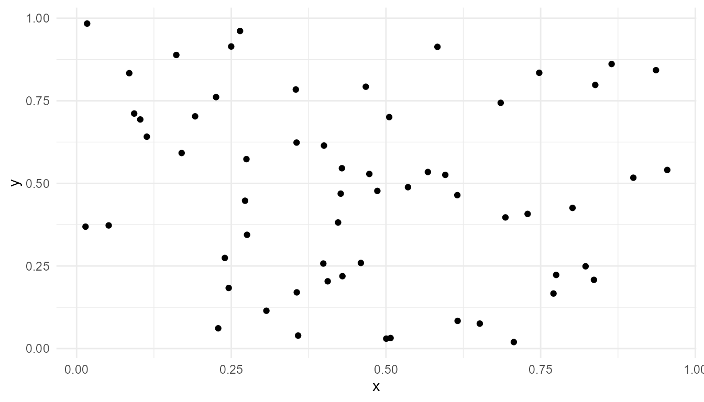

# Agents and Traits Tutorial

``` r
library(artificialLifeR)
```

## Purpose

This tutorial introduces
[`create_agents()`](https://noushinn.github.io/artificialLifeR/reference/create_agents.md).
Artificial-life simulations often begin with a population of agents.
Agents are simplified individuals with states, traits, and sometimes
locations.

In this tutorial, you will learn how to create agents, inspect their
traits, visualize their positions, and summarize trait variation.

## Create a population

``` r
agents <- create_agents(
  n_agents = 60,
  seed = 10
)

head(agents)
#>   agent          x          y    energy      speed efficiency
#> 1     1 0.50747820 0.03188816 0.8143608 0.04037269  0.5425513
#> 2     2 0.30676851 0.11446759 0.9315736 0.05405764  0.5643500
#> 3     3 0.42690767 0.46893548 0.8754516 0.04936521  0.3639694
#> 4     4 0.69310208 0.39698674 1.0510173 0.02608839  0.4801494
#> 5     5 0.08513597 0.83361919 1.1599565 0.06247362  0.5619303
#> 6     6 0.22543662 0.76112174 1.1824189 0.03170391  0.7068210
#>   reproduction_threshold age alive
#> 1               1.660511   0  TRUE
#> 2               1.574442   0  TRUE
#> 3               1.586208   0  TRUE
#> 4               1.539516   0  TRUE
#> 5               1.550912   0  TRUE
#> 6               1.487745   0  TRUE
```

## Inspect the output

``` r
str(agents)
#> 'data.frame':    60 obs. of  9 variables:
#>  $ agent                 : int  1 2 3 4 5 6 7 8 9 10 ...
#>  $ x                     : num  0.5075 0.3068 0.4269 0.6931 0.0851 ...
#>  $ y                     : num  0.0319 0.1145 0.4689 0.397 0.8336 ...
#>  $ energy                : num  0.814 0.932 0.875 1.051 1.16 ...
#>  $ speed                 : num  0.0404 0.0541 0.0494 0.0261 0.0625 ...
#>  $ efficiency            : num  0.543 0.564 0.364 0.48 0.562 ...
#>  $ reproduction_threshold: num  1.66 1.57 1.59 1.54 1.55 ...
#>  $ age                   : num  0 0 0 0 0 0 0 0 0 0 ...
#>  $ alive                 : logi  TRUE TRUE TRUE TRUE TRUE TRUE ...
```

The main columns include:

| Column                   | Meaning                                  |
|--------------------------|------------------------------------------|
| `agent`                  | Agent identifier                         |
| `x`, `y`                 | Position in the world                    |
| `energy`                 | Available energy                         |
| `speed`                  | Movement capacity                        |
| `efficiency`             | Ability to convert resources into energy |
| `reproduction_threshold` | Energy needed for reproduction           |
| `age`                    | Agent age                                |
| `alive`                  | Survival status                          |

## Plot agent positions

``` r
plot_alife_sim(
  agents,
  x = "x",
  y = "y",
  type = "point"
)
```



## Summarize traits

``` r
summary(agents[, c("energy", "speed", "efficiency", "reproduction_threshold")])
#>      energy           speed           efficiency     reproduction_threshold
#>  Min.   :0.7513   Min.   :0.01000   Min.   :0.2795   Min.   :1.256         
#>  1st Qu.:0.9002   1st Qu.:0.03243   1st Qu.:0.3915   1st Qu.:1.453         
#>  Median :1.0374   Median :0.04718   Median :0.4804   Median :1.511         
#>  Mean   :1.0114   Mean   :0.04711   Mean   :0.4853   Mean   :1.511         
#>  3rd Qu.:1.1169   3rd Qu.:0.06252   3rd Qu.:0.5575   3rd Qu.:1.582         
#>  Max.   :1.3331   Max.   :0.07942   Max.   :0.7068   Max.   :1.743
```

## Measure trait diversity

``` r
measure_life_like_complexity(
  agents,
  trait_col = "efficiency"
)
#>    n unique_values entropy     mean         sd temporal_variability
#> 1 60            60 2.97102 0.485314 0.09663056                   NA
#>   mean_abs_change
#> 1              NA
```

## Compare populations

Create two populations with different trait variability.

``` r
low_variation <- create_agents(
  n_agents = 60,
  trait_sd = 0.03,
  seed = 10
)

high_variation <- create_agents(
  n_agents = 60,
  trait_sd = 0.20,
  seed = 10
)

rbind(
  low_variation = measure_life_like_complexity(low_variation, trait_col = "efficiency"),
  high_variation = measure_life_like_complexity(high_variation, trait_col = "efficiency")
)
#>                 n unique_values entropy      mean         sd
#> low_variation  60            60 2.97102 0.4955942 0.02898917
#> high_variation 60            60 2.97102 0.4706281 0.19326112
#>                temporal_variability mean_abs_change
#> low_variation                    NA              NA
#> high_variation                   NA              NA
```

## Interpretation

Higher trait variability gives the population more initial diversity. In
artificial-life models, variation matters because selection and
adaptation require differences among individuals.

However, variation alone is not evolution. Evolution-like dynamics also
require inheritance, differential persistence, and change across
generations.

## Suggested exercises

- Increase `n_agents` and inspect how the output changes.
- Change `energy_mean` and observe the distribution of energy.
- Change `trait_sd` and compare efficiency summaries.
- Ask which traits might matter under resource competition.

## Key takeaway

[`create_agents()`](https://noushinn.github.io/artificialLifeR/reference/create_agents.md)
provides the starting population for artificial-life simulations. The
agents are simplified units, but they make it possible to explore trait
variation, energy, and individual-level differences.
