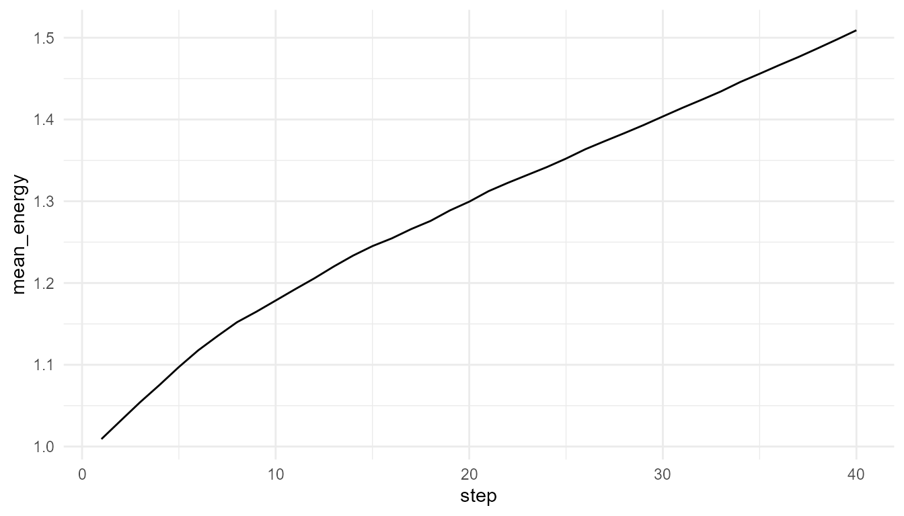
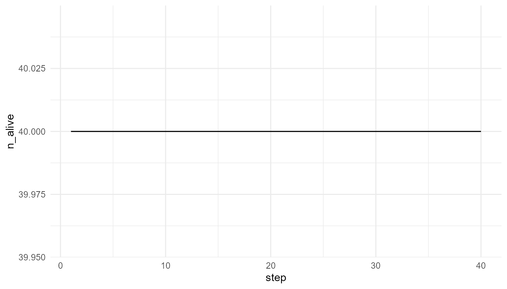

# Agents, Environments, and Local Rules

``` r
library(artificialLifeR)
```

## Purpose

This article explains why agents, environments, and local rules are
central to artificial life. Artificial-life systems often begin with
simple agents that interact with one another and with an environment
(Bedau 2003; Langton 1989; Mitchell 2009).

The purpose of this chapter is to show how artificial-life models use
simple components and rules to explore life-like dynamics such as
survival, competition, reproduction, adaptation, and population change.

The guiding question is:

> How can simple agents following local rules produce system-level
> dynamics?

## Why agents matter in artificial life

Artificial life often begins by asking how life-like organization can
arise from simpler interacting parts. Instead of starting with a fully
formed organism, an artificial-life model usually starts with simplified
units called **agents**.

An agent is a simplified unit of action. Depending on the model, agents
may represent:

- organisms;
- cells;
- molecules;
- digital entities;
- simulated individuals;
- abstract adaptive units.

The key idea is that agents do not need to be complicated for the system
to become interesting. Even simple agents can generate complex
population-level patterns when they interact with resources,
constraints, and one another over time.

## Agents as simplified individuals

Agents usually have states or traits that influence their behavior. In
`artificialLifeR`, agents may have variables such as:

- position;
- energy;
- speed;
- efficiency;
- reproduction threshold;
- age;
- survival status.

These are simplified abstractions. They do not represent full biological
organisms. Instead, they provide a small set of variables that allow
learners to explore how individual-level differences can affect
population-level outcomes.

| Agent property           | Conceptual role                          |
|--------------------------|------------------------------------------|
| `x`, `y`                 | Position in a simplified environment     |
| `energy`                 | Available internal resource              |
| `speed`                  | Movement ability                         |
| `efficiency`             | Ability to convert resources into energy |
| `reproduction_threshold` | Energy level needed for reproduction     |
| `age`                    | Time spent alive                         |
| `alive`                  | Survival status                          |

These variables make it possible to connect individual traits with
system-level behavior.

## Environments as constraints

Agents do not act in a vacuum. They exist in environments. The
environment provides opportunities, limitations, and pressures.

For example, an environment may contain:

- resources;
- spatial boundaries;
- gradients;
- hazards;
- competitors;
- changing conditions;
- limits on growth.

A resource-rich environment can support more activity. A resource-poor
environment can limit survival and reproduction. This matters because
traits are meaningful only in context.

A fast agent may be useful if resources are spread out. A highly
efficient agent may be useful if resources are scarce. A low
reproduction threshold may be useful in some conditions but costly in
others.

This is one of the central lessons of artificial life:

> Traits do not matter in isolation. They matter in relation to an
> environment.

## Local rules

Artificial-life models often use local rules. A local rule specifies how
an agent responds to nearby resources, its own state, or simple
environmental conditions.

Examples include:

- move through the environment;
- search for nearby resources;
- consume available resources;
- lose energy through movement;
- reproduce when energy is high enough;
- mutate traits during reproduction;
- die when energy falls too low.

These rules are simple, but repeated over many agents and many time
steps, they can generate population-level patterns.

This is why local rules are important. The model does not directly
impose the final population pattern. Instead, the pattern develops
through repeated agent-environment interaction.

## Local rules and system-level dynamics

A single agent following a rule may not be very interesting. But many
agents following rules in a shared environment can produce collective
dynamics.

For example:

- resource competition can reduce average energy;
- reproduction can increase population size;
- mutation can introduce variation;
- selection can shift trait distributions;
- scarcity can produce population decline;
- abundant resources can support population growth.

The system-level behavior is not programmed directly. It arises from
many local events.

This is the central logic of artificial life:

> Population-level dynamics emerge from agent-level rules and
> environmental constraints.

## Relation to the package

`artificialLifeR` represents this logic through a set of educational
simulation functions.

| Function | Conceptual role |
|----|----|
| [`create_agents()`](https://noushinn.github.io/artificialLifeR/reference/create_agents.md) | Creates a starting population with simple traits |
| [`simulate_resource_competition()`](https://noushinn.github.io/artificialLifeR/reference/simulate_resource_competition.md) | Shows how agents interact with resources |
| [`simulate_reproduction()`](https://noushinn.github.io/artificialLifeR/reference/simulate_reproduction.md) | Shows how energy and thresholds affect reproduction |
| [`simulate_mutation()`](https://noushinn.github.io/artificialLifeR/reference/simulate_mutation.md) | Shows how trait variation can be introduced |
| [`simulate_selection()`](https://noushinn.github.io/artificialLifeR/reference/simulate_selection.md) | Shows how traits can affect survival or success |
| [`simulate_population_dynamics()`](https://noushinn.github.io/artificialLifeR/reference/simulate_population_dynamics.md) | Shows population change over time |
| [`measure_life_like_complexity()`](https://noushinn.github.io/artificialLifeR/reference/measure_life_like_complexity.md) | Summarizes diversity, energy, and population-level patterns |
| [`plot_alife_sim()`](https://noushinn.github.io/artificialLifeR/reference/plot_alife_sim.md) | Visualizes simulation outputs |

Together, these functions help learners move from individual agents to
population-level dynamics.

## Example: creating agents

Start by creating a simple population.

``` r
agents <- create_agents(
  n_agents = 20,
  seed = 1
)

head(agents)
#>   agent         x         y    energy      speed efficiency
#> 1     1 0.2655087 0.9347052 1.1378466 0.04670953  0.7401618
#> 2     2 0.3721239 0.2121425 1.1173204 0.04493277  0.4960760
#> 3     3 0.5728534 0.6516738 1.0111847 0.06393927  0.5689739
#> 4     4 0.9082078 0.1255551 0.7015972 0.06113326  0.5028002
#> 5     5 0.2016819 0.2672207 1.0929739 0.03622489  0.4256727
#> 6     6 0.8983897 0.3861141 0.9915807 0.03585010  0.5188792
#>   reproduction_threshold age alive
#> 1               1.443133   0  TRUE
#> 2               1.486482   0  TRUE
#> 3               1.617809   0  TRUE
#> 4               1.347643   0  TRUE
#> 5               1.559395   0  TRUE
#> 6               1.533295   0  TRUE
```

## Interpretation

The output represents a simplified population. Each row corresponds to
an agent. The columns describe the agent’s traits or state.

This is not a realistic biological population. It is an educational
starting point for exploring how differences among agents may influence
later dynamics.

## Example: agents in a resource world

The function
[`simulate_resource_competition()`](https://noushinn.github.io/artificialLifeR/reference/simulate_resource_competition.md)
places agents in a simplified resource environment. Agents move, consume
resources, and change energy over time.

``` r
competition <- simulate_resource_competition(
  n_agents = 40,
  steps = 40,
  resource_regen = 0.20,
  seed = 2
)

head(competition$summary)
#>   step n_alive mean_energy mean_resource total_resource
#> 1    1      40    1.009159     0.7508104       22.52431
#> 2    2      40    1.031806     0.7554003       22.66201
#> 3    3      40    1.054281     0.7514201       22.54260
#> 4    4      40    1.075327     0.7282890       21.84867
#> 5    5      40    1.097265     0.7005046       21.01514
#> 6    6      40    1.117674     0.6852280       20.55684
```

## Plot mean energy

``` r
plot_alife_sim(
  competition$summary,
  x = "step",
  y = "mean_energy",
  type = "line"
)
```



## Interpretation

The average energy changes because agents move, consume resources, and
pay movement costs. The output is a population-level pattern generated
by local rules.

A careful interpretation is:

> The plot shows how average energy changes in a simplified
> artificial-life simulation.

An overstatement would be:

> The plot fully explains biological metabolism or ecological
> competition.

The first statement is appropriate. The second is too strong.

## Population size over time

If the summary output includes population size or number of living
agents, it can also be useful to plot population change.

``` r
if ("n_alive" %in% names(competition$summary)) {
  plot_alife_sim(
    competition$summary,
    x = "step",
    y = "n_alive",
    type = "line"
  )
}
```



## Interpretation of population change

Population size is one of the simplest system-level outcomes in
artificial-life models. It can reflect the balance between energy
intake, movement cost, reproduction, and death.

However, population size alone does not fully describe the system. A
population may remain large but lose trait diversity, or it may become
smaller while becoming more efficient.

This is why artificial-life models often require multiple summaries.

## Compare resource regeneration

The environment can be changed by modifying `resource_regen`. This
parameter represents how quickly resources return to the environment.

``` r
low_resource <- simulate_resource_competition(
  n_agents = 40,
  steps = 40,
  resource_regen = 0.05,
  seed = 2
)

high_resource <- simulate_resource_competition(
  n_agents = 40,
  steps = 40,
  resource_regen = 0.50,
  seed = 2
)

head(low_resource$summary)
#>   step n_alive mean_energy mean_resource total_resource
#> 1    1      40    1.009159     0.6556781       19.67034
#> 2    2      40    1.028568     0.5896597       17.68979
#> 3    3      40    1.044949     0.5321445       15.96434
#> 4    4      40    1.054029     0.4870080       14.61024
#> 5    5      40    1.059806     0.4504424       13.51327
#> 6    6      40    1.061999     0.4258547       12.77564
head(high_resource$summary)
#>   step n_alive mean_energy mean_resource total_resource
#> 1    1      40    1.009159     0.8629093       25.88728
#> 2    2      40    1.033373     0.8614894       25.84468
#> 3    3      40    1.059141     0.8638543       25.91563
#> 4    4      40    1.084908     0.8632986       25.89896
#> 5    5      40    1.112961     0.8595924       25.78777
#> 6    6      40    1.141014     0.8590929       25.77279
```

## Compare mean energy

``` r
low_final_energy <- tail(low_resource$summary$mean_energy, 1)
high_final_energy <- tail(high_resource$summary$mean_energy, 1)

data.frame(
  scenario = c("low resource regeneration", "high resource regeneration"),
  final_mean_energy = c(low_final_energy, high_final_energy)
)
#>                     scenario final_mean_energy
#> 1  low resource regeneration         0.7210474
#> 2 high resource regeneration         2.1564944
```

## Interpretation of resource regeneration

Changing resource regeneration changes the environmental constraint. If
resources regenerate slowly, agents may have more difficulty maintaining
energy. If resources regenerate quickly, agents may have more
opportunity to survive, move, and reproduce.

This shows that agent behavior cannot be interpreted separately from the
environment.

## Local does not mean trivial

A local rule can be simple, but the system-level outcome may still be
difficult to anticipate.

For example, a simple rule such as “consume nearby resources” can
interact with:

- movement cost;
- resource regeneration;
- agent density;
- reproduction threshold;
- mutation;
- survival rules.

The resulting system may show population growth, collapse,
stabilization, or trait change.

This is one reason artificial life is valuable for education. It allows
learners to see how local rules scale into population-level dynamics.

## Agents and emergence

Artificial life is closely related to emergence. The model starts with
individual agents and local rules. The interesting pattern appears at
the system level.

| Level             | Example in artificial-life models                 |
|-------------------|---------------------------------------------------|
| Agent level       | Energy, traits, movement, reproduction            |
| Interaction level | Competition, resource consumption, local response |
| Environment level | Resource availability, constraints, regeneration  |
| Population level  | Growth, decline, adaptation, diversity            |

An artificial-life explanation connects these levels. It does not only
describe the individual agent, and it does not only describe the
population. It explains how one level gives rise to another.

## Relation to life and cognition

Living systems involve agents and environments at many levels:

- molecules interact inside cells;
- cells interact in tissues;
- organisms interact in ecosystems;
- populations interact with changing environments.

Cognitive systems also involve agent-environment interaction through
perception, action, feedback, and adaptation.

`artificialLifeR` does not model these systems in detail, but it helps
explain why local rules and environmental constraints matter. It
provides simple simulations that make agent-environment dynamics
visible.

## What this model captures

The examples in this chapter capture several important ideas:

- agents can have different states and traits;
- environments create opportunities and constraints;
- local rules can generate population-level patterns;
- energy and resources shape survival and reproduction;
- system-level dynamics arise over time;
- interpretation requires connecting agents, rules, and environments.

These ideas are central to artificial-life modeling.

## What this model does not capture

The models are intentionally simplified. They do not include:

- real metabolism;
- real genetic systems;
- detailed development;
- complex behavior;
- perception;
- learning;
- real ecological networks;
- full biological evolution.

They are toy models for teaching. Their value lies in conceptual
clarity, not biological realism.

## Responsible interpretation

It is better to say:

> The simulation illustrates how simple agents can interact with
> resources in a simplified environment.

than:

> The simulation explains real biological life.

It is better to say:

> The model shows how local rules and environmental constraints can
> shape population-level patterns.

than:

> The model proves how life emerges.

Careful interpretation keeps the package academically credible.

## Educational use

This chapter can support several classroom or self-study questions:

- What is an agent?
- What does the environment contribute to the model?
- Why do traits depend on context?
- How do local rules generate population-level outcomes?
- What happens when resource availability changes?
- What is the difference between an agent-level variable and a
  population-level pattern?
- What would need to be added to make the model more realistic?

These questions help learners understand artificial life as a bottom-up
modeling approach.

## Key takeaway

Artificial-life models begin with agents, environments, and local rules.
System-level behavior arises when agents repeatedly act, interact,
consume resources, reproduce, mutate, or die over time.

`artificialLifeR` uses this logic to make life-like dynamics visible and
teachable. The package does not simulate real life in full detail, but
it helps users explore how simple local rules can generate
population-level patterns.

## References

Bedau, Mark A. 2003. “Artificial Life: Organization, Adaptation and
Complexity from the Bottom Up.” *Trends in Cognitive Sciences* 7 (11):
505–12.

Langton, Christopher G. 1989. “Artificial Life.” In *Artificial Life*,
edited by Christopher G. Langton, 1–47. Addison-Wesley.

Mitchell, Melanie. 2009. *Complexity: A Guided Tour*. Oxford University
Press.
