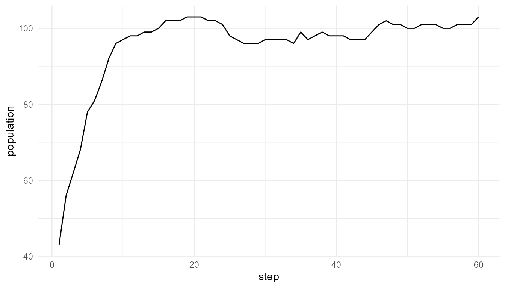

# Comparing Artificial-Life Models Tutorial

``` r
library(artificialLifeR)
```

## Purpose

This tutorial compares several artificial-life models included in
`artificialLifeR`. The goal is to understand how agents, resources,
reproduction, mutation, selection, and population dynamics each
contribute to life-like behavior.

## Run several models

``` r
agents <- create_agents(n_agents = 50, seed = 1)
competition <- simulate_resource_competition(n_agents = 50, steps = 40, seed = 2)
population <- simulate_population_dynamics(initial_population = 40, steps = 60, seed = 3)
selected <- simulate_selection(agents, survival_fraction = 0.50, seed = 4)
```

## Inspect outputs

``` r
head(agents)
#>   agent         x          y    energy      speed efficiency
#> 1     1 0.2655087 0.47761962 1.0597159 0.03759267  0.5450187
#> 2     2 0.3721239 0.86120948 0.9081960 0.05084232  0.4981440
#> 3     3 0.5728534 0.43809711 1.0511680 0.03178157  0.4681932
#> 4     4 0.9082078 0.24479728 0.8305955 0.05316058  0.4070638
#> 5     5 0.2016819 0.07067905 1.2149536 0.03690831  0.3512540
#> 6     6 0.8983897 0.09946616 1.2970600 0.08534575  0.3924808
#>   reproduction_threshold age alive
#> 1               1.540940   0  TRUE
#> 2               1.668887   0  TRUE
#> 3               1.658659   0  TRUE
#> 4               1.466909   0  TRUE
#> 5               1.271476   0  TRUE
#> 6               1.749766   0  TRUE
head(competition$summary)
#>   step n_alive mean_energy mean_resource total_resource
#> 1    1      50   0.9920413     0.7355619       22.06686
#> 2    2      50   1.0104519     0.7045157       21.13547
#> 3    3      50   1.0265316     0.6795264       20.38579
#> 4    4      50   1.0365931     0.6723698       20.17109
#> 5    5      50   1.0469975     0.6577956       19.73387
#> 6    6      50   1.0557799     0.6461239       19.38372
head(population$summary)
#>   step population mean_energy mean_efficiency  trait_sd
#> 1    1         43    1.147430       0.4953384 0.1185816
#> 2    2         56    1.046536       0.5186439 0.1208978
#> 3    3         62    1.094271       0.5189123 0.1176532
#> 4    4         68    1.117338       0.5186126 0.1187843
#> 5    5         78    1.071779       0.5288703 0.1248649
#> 6    6         81    1.101884       0.5333708 0.1248362
head(selected)
#>    agent         x          y   energy      speed efficiency
#> 43    43 0.7829328 0.64228826 1.174060 0.01670055  0.4268252
#> 21    21 0.9347052 0.33907294 1.071326 0.03988085  0.7307978
#> 29    29 0.8696908 0.77732070 1.011151 0.03636679  0.6027392
#> 33    33 0.4935413 0.39999437 1.176713 0.06062992  0.5219925
#> 40    40 0.4112744 0.14330438 1.040065 0.04886206  0.4073891
#> 42    42 0.6470602 0.05893438 1.181180 0.07353167  0.5402012
#>    reproduction_threshold age alive   fitness
#> 43               1.522348   0  TRUE 0.5011185
#> 21               1.326678   0  TRUE 0.7829230
#> 29               1.519719   0  TRUE 0.6094605
#> 33               1.435952   0  TRUE 0.6142354
#> 40               1.499466   0  TRUE 0.4237110
#> 42               1.603411   0  TRUE 0.6380749
```

## Compare model roles

| Model | Unit | Main process | Output pattern |
|----|----|----|----|
| Agents | Individual agent | Trait initialization | Population variation |
| Resource competition | Agent and environment | Energy gain and cost | Survival and energy change |
| Selection | Agent population | Fitness-based persistence | Changed population composition |
| Population dynamics | Population through time | Birth, death, mutation, capacity | Population growth or decline |

## Compare summaries

``` r
rbind(
  initial_efficiency = measure_life_like_complexity(agents, trait_col = "efficiency"),
  selected_efficiency = measure_life_like_complexity(selected, trait_col = "efficiency"),
  competition_energy = measure_life_like_complexity(competition$agents, trait_col = "energy", time_col = "step"),
  population_efficiency = measure_life_like_complexity(population$agents, trait_col = "efficiency", time_col = "step")
)
#>                          n unique_values  entropy      mean        sd
#> initial_efficiency      50            50 3.145659 0.5076869 0.1008672
#> selected_efficiency     25            25 3.063465 0.5105145 0.1037437
#> competition_energy    2000          1999 2.900350 1.1301868 0.5258798
#> population_efficiency 5731            46 2.881358 0.5864819 0.1215391
#>                       temporal_variability mean_abs_change
#> initial_efficiency                      NA              NA
#> selected_efficiency                     NA              NA
#> competition_energy              0.06078271     0.005784354
#> population_efficiency           0.04399075     0.002700233
```

## Compare population scenarios

``` r
low_mutation <- simulate_population_dynamics(
  initial_population = 40,
  steps = 60,
  mutation_rate = 0.01,
  seed = 5
)

high_mutation <- simulate_population_dynamics(
  initial_population = 40,
  steps = 60,
  mutation_rate = 0.30,
  seed = 5
)

data.frame(
  scenario = c("low mutation", "high mutation"),
  final_population = c(tail(low_mutation$summary$population, 1), tail(high_mutation$summary$population, 1)),
  final_trait_sd = c(tail(low_mutation$summary$trait_sd, 1), tail(high_mutation$summary$trait_sd, 1))
)
#>        scenario final_population final_trait_sd
#> 1  low mutation              100     0.07268323
#> 2 high mutation               99     0.07432279
```

## Visualize population comparison

``` r
plot_alife_sim(
  population$summary,
  x = "step",
  y = "population",
  type = "line"
)
```



## Interpretation

The models represent different parts of artificial life. Agent creation
gives variation. Resource competition gives environmental constraint.
Reproduction gives inheritance. Mutation gives novelty. Selection
changes population composition. Population dynamics show how
individual-level rules accumulate over time.

A strong interpretation compares mechanisms, not only numbers.

## Choosing the right model

| Question | Useful function |
|----|----|
| What variation exists in the initial population? | [`create_agents()`](https://noushinn.github.io/artificialLifeR/reference/create_agents.md) |
| How do resources affect survival? | [`simulate_resource_competition()`](https://noushinn.github.io/artificialLifeR/reference/simulate_resource_competition.md) |
| How do offspring inherit traits? | [`simulate_reproduction()`](https://noushinn.github.io/artificialLifeR/reference/simulate_reproduction.md) |
| How does variation enter a population? | [`simulate_mutation()`](https://noushinn.github.io/artificialLifeR/reference/simulate_mutation.md) |
| How does fitness affect persistence? | [`simulate_selection()`](https://noushinn.github.io/artificialLifeR/reference/simulate_selection.md) |
| How does population size change over time? | [`simulate_population_dynamics()`](https://noushinn.github.io/artificialLifeR/reference/simulate_population_dynamics.md) |

## Responsible interpretation

It is better to say:

> These models illustrate different mechanisms of artificial life.

than:

> These models fully explain biological life.

## Key takeaway

`artificialLifeR` is strongest when its models are understood together.
Life-like organization depends on several interacting ideas: agents,
environments, variation, inheritance, selection, and population-level
change.
