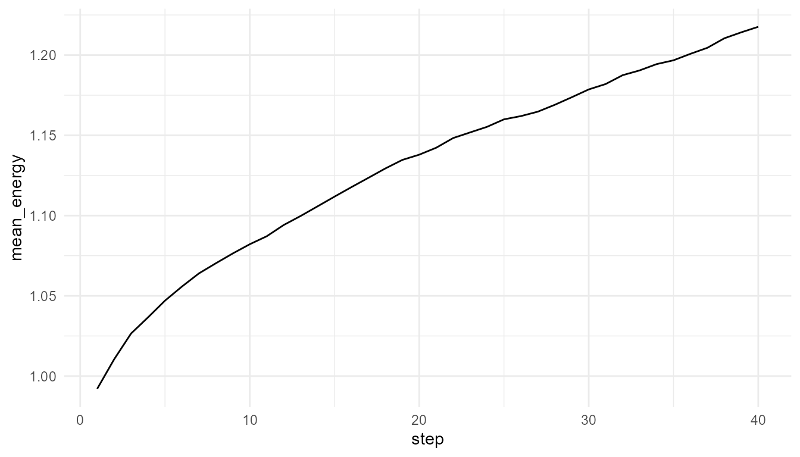
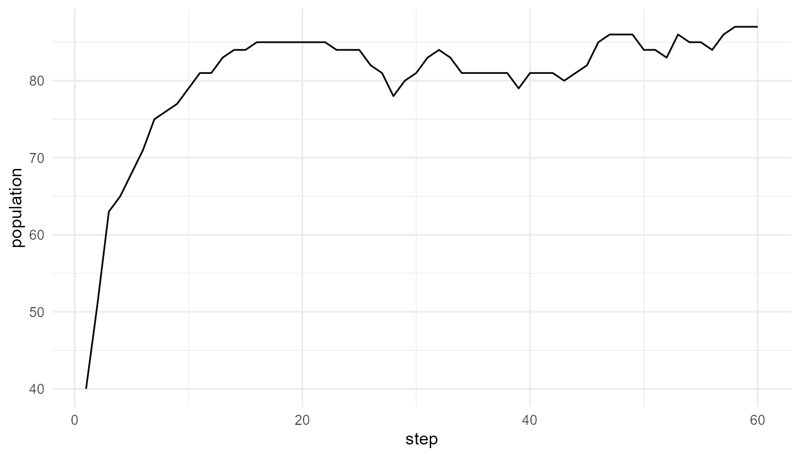

# Getting Started with artificialLifeR

``` r
library(artificialLifeR)
```

## Overview

`artificialLifeR` is an educational R package for exploring
artificial-life ideas through simplified simulations. The package
focuses on agents, resources, reproduction, mutation, selection,
population dynamics, and life-like complexity.

The central idea is:

> Life-like patterns can arise from local interaction, variation,
> inheritance, and environmental constraint.

The simulations are toy models. They are designed for teaching and
conceptual exploration, not for realistic biological prediction.

## What the package helps you explore

| Model family | Main question | Core function |
|----|----|----|
| Agents and traits | What are the artificial individuals? | [`create_agents()`](https://noushinn.github.io/artificialLifeR/reference/create_agents.md) |
| Resource competition | How do agents interact with an environment? | [`simulate_resource_competition()`](https://noushinn.github.io/artificialLifeR/reference/simulate_resource_competition.md) |
| Reproduction | How can offspring inherit traits? | [`simulate_reproduction()`](https://noushinn.github.io/artificialLifeR/reference/simulate_reproduction.md) |
| Mutation | How does variation enter a population? | [`simulate_mutation()`](https://noushinn.github.io/artificialLifeR/reference/simulate_mutation.md) |
| Selection | How do some agents persist more than others? | [`simulate_selection()`](https://noushinn.github.io/artificialLifeR/reference/simulate_selection.md) |
| Population dynamics | How does population size change over time? | [`simulate_population_dynamics()`](https://noushinn.github.io/artificialLifeR/reference/simulate_population_dynamics.md) |
| Measurement | How can outputs be summarized? | [`measure_life_like_complexity()`](https://noushinn.github.io/artificialLifeR/reference/measure_life_like_complexity.md) |

## First example: create agents

``` r
agents <- create_agents(
  n_agents = 50,
  seed = 1
)

head(agents)
#>   agent         x          y    energy      speed efficiency
#> 1     1 0.2655087 0.47761962 1.0597159 0.03759267  0.5450187
#> 2     2 0.3721239 0.86120948 0.9081960 0.05084232  0.4981440
#> 3     3 0.5728534 0.43809711 1.0511680 0.03178157  0.4681932
#> 4     4 0.9082078 0.24479728 0.8305955 0.05316058  0.4070638
#> 5     5 0.2016819 0.07067905 1.2149536 0.03690831  0.3512540
#> 6     6 0.8983897 0.09946616 1.2970600 0.08534575  0.3924808
#>   reproduction_threshold age alive
#> 1               1.540940   0  TRUE
#> 2               1.668887   0  TRUE
#> 3               1.658659   0  TRUE
#> 4               1.466909   0  TRUE
#> 5               1.271476   0  TRUE
#> 6               1.749766   0  TRUE
```

## Interpretation

Each row represents one artificial agent. The agents have positions,
energy, and simple traits such as speed and efficiency.

These agents are not organisms. They are simplified units for exploring
artificial-life ideas.

## Resource competition

``` r
competition <- simulate_resource_competition(
  n_agents = 50,
  steps = 40,
  resource_regen = 0.20,
  seed = 2
)

head(competition$summary)
#>   step n_alive mean_energy mean_resource total_resource
#> 1    1      50   0.9920413     0.7355619       22.06686
#> 2    2      50   1.0104519     0.7045157       21.13547
#> 3    3      50   1.0265316     0.6795264       20.38579
#> 4    4      50   1.0365931     0.6723698       20.17109
#> 5    5      50   1.0469975     0.6577956       19.73387
#> 6    6      50   1.0557799     0.6461239       19.38372
```

## Plot average energy

``` r
plot_alife_sim(
  competition$summary,
  x = "step",
  y = "mean_energy",
  type = "line"
)
```



## Measure life-like complexity

``` r
measure_life_like_complexity(
  competition$agents,
  trait_col = "energy",
  time_col = "step"
)
#>      n unique_values entropy     mean        sd temporal_variability
#> 1 2000          1999 2.90035 1.130187 0.5258798           0.06078271
#>   mean_abs_change
#> 1     0.005784354
```

## Population dynamics

``` r
pop <- simulate_population_dynamics(
  initial_population = 40,
  steps = 60,
  carrying_capacity = 100,
  seed = 3
)

head(pop$summary)
#>   step population mean_energy mean_efficiency  trait_sd
#> 1    1         40    1.200125       0.4912442 0.1216771
#> 2    2         51    1.088529       0.5132234 0.1215461
#> 3    3         63    1.000476       0.5186715 0.1169869
#> 4    4         65    1.043270       0.5173388 0.1159313
#> 5    5         68    1.071840       0.5147596 0.1142854
#> 6    6         71    1.088787       0.5247883 0.1217227
```

``` r
plot_alife_sim(
  pop$summary,
  x = "step",
  y = "population",
  type = "line"
)
```



## Suggested learning path

1.  Start with
    [`create_agents()`](https://noushinn.github.io/artificialLifeR/reference/create_agents.md)
    to understand traits and populations.
2.  Use
    [`simulate_resource_competition()`](https://noushinn.github.io/artificialLifeR/reference/simulate_resource_competition.md)
    to explore agents in an environment.
3.  Use
    [`simulate_reproduction()`](https://noushinn.github.io/artificialLifeR/reference/simulate_reproduction.md)
    and
    [`simulate_mutation()`](https://noushinn.github.io/artificialLifeR/reference/simulate_mutation.md)
    to explore inheritance and variation.
4.  Use
    [`simulate_selection()`](https://noushinn.github.io/artificialLifeR/reference/simulate_selection.md)
    to explore fitness-based survival.
5.  Use
    [`simulate_population_dynamics()`](https://noushinn.github.io/artificialLifeR/reference/simulate_population_dynamics.md)
    to study population-level change.
6.  Use
    [`measure_life_like_complexity()`](https://noushinn.github.io/artificialLifeR/reference/measure_life_like_complexity.md)
    and
    [`plot_alife_sim()`](https://noushinn.github.io/artificialLifeR/reference/plot_alife_sim.md)
    to summarize and visualize outputs.
7.  Read the Theory Guide to connect the code to artificial life,
    emergence, origin-of-life research, and responsible interpretation.

## Responsible interpretation

It is better to say:

> The model illustrates life-like dynamics in a simplified artificial
> system.

than:

> The model creates or fully explains life.
