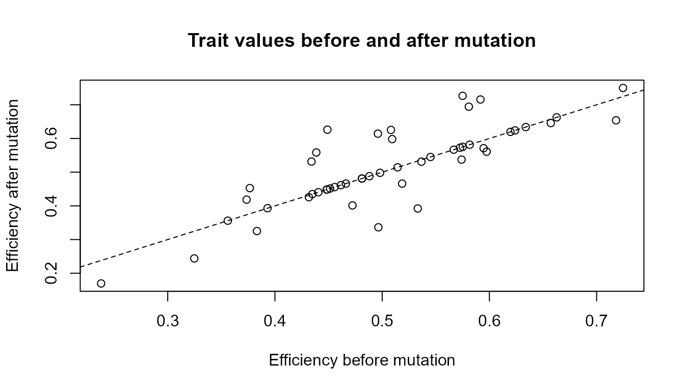

# Mutation, Variation, and Novelty

``` r
library(artificialLifeR)
```

## Purpose

This article explains mutation, variation, and novelty in
artificial-life models. Variation is essential because selection
requires differences among individuals (Darwin 1859; Nowak 2006).

The purpose of this chapter is to show how novelty can enter an
artificial population and why variation matters for adaptation-like
dynamics.

The guiding question is:

> How does novelty enter an artificial population?

## Why variation matters

A population with no variation has limited capacity for adaptive change.
If all agents are identical, selection has little to distinguish. Every
agent has the same traits, the same potential advantages, and the same
vulnerabilities.

Variation changes this. Once agents differ, some traits may become more
successful than others under particular environmental conditions.

For example:

- faster agents may reach resources more easily;
- more efficient agents may convert resources into energy more
  effectively;
- agents with lower reproduction thresholds may reproduce earlier;
- agents with higher energy may survive longer.

In artificial-life models, variation provides the raw material for
selection-like processes.

## Variation versus mutation

Variation and mutation are related, but they are not the same.

**Variation** refers to differences among agents in a population.

**Mutation** refers to one mechanism that can create or modify those
differences.

A population can have variation because agents were initialized
differently. It can also gain variation over time because offspring
differ from parents.

| Concept                | Meaning                                  |
|------------------------|------------------------------------------|
| Variation              | Differences among agents                 |
| Mutation               | Random change to a trait                 |
| Novelty                | New trait values or new combinations     |
| Selection              | Differential persistence or reproduction |
| Adaptation-like change | Shift in population traits over time     |

In `artificialLifeR`, variation can appear through initial trait
differences and through mutation.

## Mutation as controlled noise

In biological systems, mutation refers to changes in genetic material.
In `artificialLifeR`, mutation is much simpler. It is represented as
random numeric change applied to a selected trait.

This is not a full genetic mutation model. It does not represent DNA,
RNA, molecular replication, recombination, repair, or developmental
biology.

Instead, mutation is used as a teaching abstraction:

> Mutation introduces small changes that can alter trait distributions.

This makes it possible to explore how novelty enters a population
without modelling molecular genetics.

## Relation to the package

The function
[`simulate_mutation()`](https://noushinn.github.io/artificialLifeR/reference/simulate_mutation.md)
applies mutation-like changes to a selected trait.

| Argument        | Conceptual meaning                        |
|-----------------|-------------------------------------------|
| `agents`        | Starting population                       |
| `trait`         | Trait to modify                           |
| `mutation_rate` | Probability that an agent’s trait changes |
| `mutation_sd`   | Size of random mutation effect            |
| `lower`         | Lower bound for trait values              |
| `upper`         | Upper bound for trait values              |
| `seed`          | Reproducibility                           |

The mutation rate controls how often mutation occurs.  
The mutation size controls how large the changes are.  
The bounds prevent trait values from moving outside the allowed range.

## Example: create a population

Start by creating a simple population.

``` r
agents <- create_agents(
  n_agents = 50,
  seed = 5
)

head(agents)
#>   agent         x         y    energy      speed efficiency
#> 1     1 0.2002145 0.3845769 1.2194873 0.01009226  0.5946089
#> 2     2 0.6852186 0.5662727 1.0281589 0.07270623  0.5751771
#> 3     3 0.9168758 0.9219906 1.1533034 0.06351589  0.4482623
#> 4     4 0.2843995 0.9758776 0.9112248 0.05416967  0.5808336
#> 5     5 0.1046501 0.9330338 0.9831699 0.04884309  0.4385465
#> 6     6 0.7010575 0.3811627 0.8612570 0.06787623  0.6238259
#>   reproduction_threshold age alive
#> 1               1.488632   0  TRUE
#> 2               1.470490   0  TRUE
#> 3               1.598917   0  TRUE
#> 4               1.422487   0  TRUE
#> 5               1.527590   0  TRUE
#> 6               1.541078   0  TRUE
```

## Measure the starting variation

Before mutation, summarize variation in the selected trait.

``` r
measure_life_like_complexity(
  agents,
  trait_col = "efficiency"
)
#>    n unique_values  entropy      mean        sd temporal_variability
#> 1 50            50 2.889669 0.5066717 0.0989657                   NA
#>   mean_abs_change
#> 1              NA
```

## Apply mutation

Now apply mutation to the `efficiency` trait.

``` r
mutated <- simulate_mutation(
  agents,
  trait = "efficiency",
  mutation_rate = 0.50,
  mutation_sd = 0.08,
  lower = 0.01,
  upper = 1,
  seed = 5
)

head(mutated)
#>   agent         x         y    energy      speed efficiency
#> 1     1 0.2002145 0.3845769 1.2194873 0.01009226  0.5711303
#> 2     2 0.6852186 0.5662727 1.0281589 0.07270623  0.5751771
#> 3     3 0.9168758 0.9219906 1.1533034 0.06351589  0.4482623
#> 4     4 0.2843995 0.9758776 0.9112248 0.05416967  0.6943207
#> 5     5 0.1046501 0.9330338 0.9831699 0.04884309  0.5584484
#> 6     6 0.7010575 0.3811627 0.8612570 0.06787623  0.6238259
#>   reproduction_threshold age alive
#> 1               1.488632   0  TRUE
#> 2               1.470490   0  TRUE
#> 3               1.598917   0  TRUE
#> 4               1.422487   0  TRUE
#> 5               1.527590   0  TRUE
#> 6               1.541078   0  TRUE
```

## Compare before and after mutation

``` r
rbind(
  before = measure_life_like_complexity(
    agents,
    trait_col = "efficiency"
  ),
  after = measure_life_like_complexity(
    mutated,
    trait_col = "efficiency"
  )
)
#>         n unique_values  entropy      mean        sd temporal_variability
#> before 50            50 2.889669 0.5066717 0.0989657                   NA
#> after  50            50 3.015854 0.5154477 0.1213256                   NA
#>        mean_abs_change
#> before              NA
#> after               NA
```

## Interpretation

Mutation changes the distribution of efficiency values. It can increase,
decrease, or reshape variation depending on mutation rate, mutation
size, and trait bounds.

A careful interpretation is:

> The simulation shows how random trait changes can alter variation in
> an artificial population.

An overstatement would be:

> The simulation fully models biological mutation.

The first statement is appropriate. The second is not.

## Visualizing trait change

If the plotting function supports point or histogram-style outputs, you
can inspect trait values directly. A simple base R plot is also useful
for this chapter.

``` r
plot(
  agents$efficiency,
  mutated$efficiency,
  xlab = "Efficiency before mutation",
  ylab = "Efficiency after mutation",
  main = "Trait values before and after mutation"
)

abline(0, 1, lty = 2)
```



## Interpretation of the plot

Each point represents one agent. Points close to the dashed line changed
little. Points farther from the line changed more.

This plot helps show that mutation is not a population-level command to
become better. It is a source of variation. Some changes may be useful,
some may be harmful, and many may be neutral depending on the
environment.

## Mutation rate

The `mutation_rate` controls how many agents are affected by mutation.

A low mutation rate means few agents change.  
A high mutation rate means many agents change.

``` r
low_mutation <- simulate_mutation(
  agents,
  trait = "efficiency",
  mutation_rate = 0.05,
  mutation_sd = 0.08,
  lower = 0.01,
  upper = 1,
  seed = 5
)

high_mutation <- simulate_mutation(
  agents,
  trait = "efficiency",
  mutation_rate = 0.80,
  mutation_sd = 0.08,
  lower = 0.01,
  upper = 1,
  seed = 5
)

rbind(
  original = measure_life_like_complexity(
    agents,
    trait_col = "efficiency"
  ),
  low_mutation = measure_life_like_complexity(
    low_mutation,
    trait_col = "efficiency"
  ),
  high_mutation = measure_life_like_complexity(
    high_mutation,
    trait_col = "efficiency"
  )
)
#>                n unique_values  entropy      mean         sd
#> original      50            50 2.889669 0.5066717 0.09896570
#> low_mutation  50            50 2.856233 0.5084719 0.09675427
#> high_mutation 50            50 3.082754 0.5154907 0.12512048
#>               temporal_variability mean_abs_change
#> original                        NA              NA
#> low_mutation                    NA              NA
#> high_mutation                   NA              NA
```

## Interpretation of mutation rate

Changing the mutation rate changes how often novelty enters the
population.

A low mutation rate may preserve continuity but introduce little
novelty. A high mutation rate may introduce more novelty but may also
disrupt inherited structure.

This is important because artificial-life systems often depend on a
balance between continuity and change.

## Mutation size

The `mutation_sd` controls the size of the mutation effect.

Small mutation sizes create small changes.  
Large mutation sizes create larger jumps in trait values.

``` r
small_mutation <- simulate_mutation(
  agents,
  trait = "efficiency",
  mutation_rate = 0.50,
  mutation_sd = 0.02,
  lower = 0.01,
  upper = 1,
  seed = 5
)

large_mutation <- simulate_mutation(
  agents,
  trait = "efficiency",
  mutation_rate = 0.50,
  mutation_sd = 0.20,
  lower = 0.01,
  upper = 1,
  seed = 5
)

rbind(
  original = measure_life_like_complexity(
    agents,
    trait_col = "efficiency"
  ),
  small_mutation = measure_life_like_complexity(
    small_mutation,
    trait_col = "efficiency"
  ),
  large_mutation = measure_life_like_complexity(
    large_mutation,
    trait_col = "efficiency"
  )
)
#>                 n unique_values  entropy      mean        sd
#> original       50            50 2.889669 0.5066717 0.0989657
#> small_mutation 50            50 2.880960 0.5088657 0.1008750
#> large_mutation 50            50 2.907012 0.5286118 0.1977515
#>                temporal_variability mean_abs_change
#> original                         NA              NA
#> small_mutation                   NA              NA
#> large_mutation                   NA              NA
```

## Interpretation of mutation size

Mutation size affects how far traits can move. Small changes may
preserve similarity between parent and offspring. Large changes can
create more dramatic novelty but may also move traits away from
previously successful values.

In artificial-life terms:

> Mutation explores nearby or distant possibilities in trait space.

The best mutation size depends on the model and question.

## Trait bounds

The `lower` and `upper` arguments define the allowed trait range. These
bounds are important because not every numeric value makes sense.

For example, efficiency may be limited to a positive range. Speed may
have a minimum and maximum. Reproduction thresholds may need to remain
biologically or conceptually plausible.

Trait bounds represent simplified constraints.

``` r
bounded_mutation <- simulate_mutation(
  agents,
  trait = "efficiency",
  mutation_rate = 0.80,
  mutation_sd = 0.30,
  lower = 0.01,
  upper = 1,
  seed = 6
)

range(bounded_mutation$efficiency)
#> [1] 0.01 1.00
```

## Interpretation of bounds

The range shows that mutation did not push the selected trait outside
the specified limits.

This is important because artificial-life models often need constraints.
Without constraints, mutation can create values that are mathematically
possible but conceptually meaningless.

## Novelty is not automatically improvement

Mutation introduces novelty, but novelty is not automatically
beneficial.

A mutation may:

- improve performance in a particular environment;
- reduce performance;
- have no clear effect;
- matter only under certain conditions;
- become useful later if the environment changes.

Selection-like processes determine whether some variations become more
common over time. Mutation introduces possibilities. Selection filters
them.

This relationship is central:

> Mutation generates variation. Selection changes the frequency of
> variation.

## Balance between stability and novelty

Too little mutation may limit novelty. Too much mutation may disrupt
inherited structure.

Artificial-life systems often become interesting when they balance
continuity and change. This balance is related to broader complexity
ideas: systems need enough stability to preserve organization and enough
variability to explore new possibilities (Langton 1990; Mitchell 2009).

A useful way to think about it is:

| Mutation level | Possible consequence                     |
|----------------|------------------------------------------|
| Very low       | Population may stagnate                  |
| Moderate       | Population can explore new possibilities |
| Very high      | Population may lose stable inheritance   |

This is not a universal rule, but it is a useful educational guide.

## Mutation and evolvability

Evolvability refers to the capacity of a system to generate heritable
variation that can support adaptive change.

Mutation contributes to evolvability because it introduces new trait
values. But mutation alone is not enough. Evolvability also depends on:

- inheritance;
- selection;
- environmental constraints;
- population structure;
- survival and reproduction;
- continuity across generations.

[`simulate_mutation()`](https://noushinn.github.io/artificialLifeR/reference/simulate_mutation.md)
illustrates only one part of this broader process.

## Responsible interpretation

Mutation in this package is abstract. It does not represent DNA,
molecular biology, or real genetic mechanisms. It represents the general
idea that traits can vary.

It is better to say:

> The simulation illustrates mutation-like trait variation.

than:

> The simulation models real genetic mutation.

It is better to say:

> Mutation can introduce novelty into an artificial population.

than:

> Mutation automatically improves the population.

Careful interpretation keeps the model clear and academically credible.

## Relation to other artificial-life processes

Mutation becomes most meaningful when connected to other artificial-life
processes.

| Process              | Role                            |
|----------------------|---------------------------------|
| Reproduction         | Maintains continuity            |
| Mutation             | Introduces variation            |
| Selection            | Changes trait frequencies       |
| Resource competition | Creates environmental pressure  |
| Population dynamics  | Shows system-level consequences |

Together, these processes help explain how artificial populations can
change over time.

## Educational use

This chapter can support several classroom or self-study questions:

- Why is variation necessary for selection?
- How does mutation differ from variation?
- What happens when mutation rate is low?
- What happens when mutation rate is high?
- What happens when mutation size changes?
- Why is novelty not automatically improvement?
- Why are trait bounds important?
- How does mutation support evolvability?

These questions help learners understand mutation as one part of a
broader artificial-life system.

## Key takeaway

Mutation introduces novelty into artificial populations by modifying
traits. It is most meaningful when combined with inheritance, selection,
resources, and population dynamics.

`artificialLifeR` represents mutation as simplified numeric trait
variation. This makes the concept visible and teachable while preserving
the distinction between artificial-life toy models and real biological
genetics.

## References

Darwin, Charles. 1859. *On the Origin of Species*. John Murray.

Langton, Christopher G. 1990. “Computation at the Edge of Chaos: Phase
Transitions and Emergent Computation.” *Physica D: Nonlinear Phenomena*
42 (1–3): 12–37.

Mitchell, Melanie. 2009. *Complexity: A Guided Tour*. Oxford University
Press.

Nowak, Martin A. 2006. *Evolutionary Dynamics: Exploring the Equations
of Life*. Harvard University Press.
