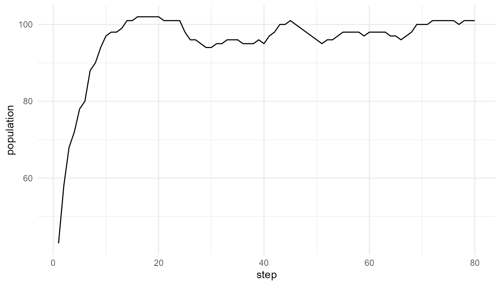
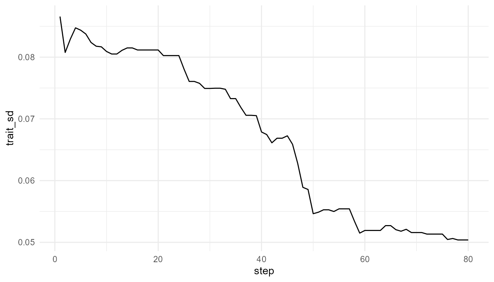
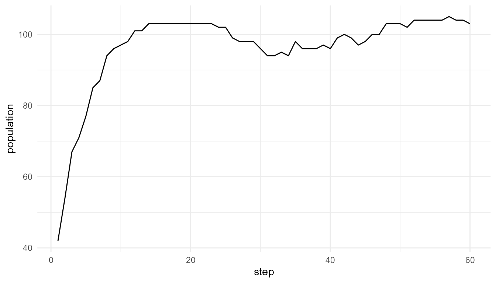
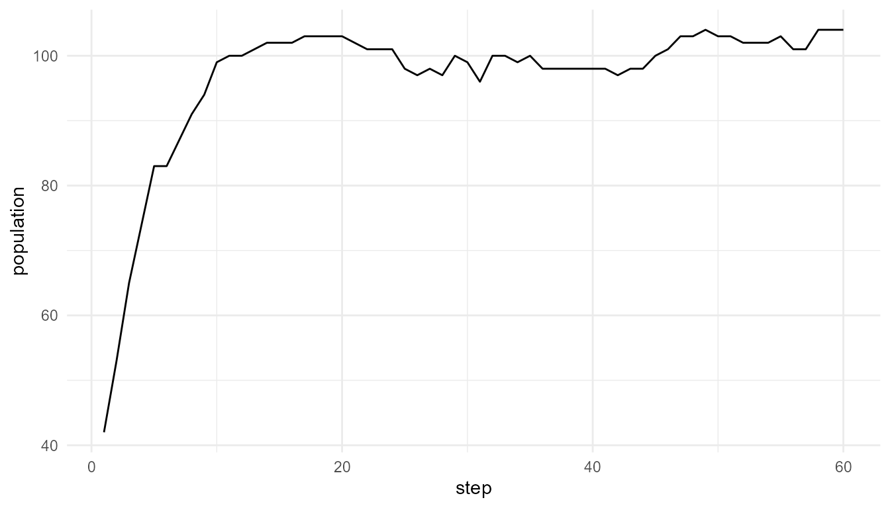

# Population Dynamics and Evolvability

``` r
library(artificialLifeR)
```

## Purpose

This article explains population dynamics and evolvability in
artificial-life models. Population dynamics describe how population size
and composition change over time. Evolvability refers to a system’s
capacity to generate heritable variation that can support adaptive
change (Kauffman 1993; Nowak 2006).

The purpose of this chapter is to show how birth, death, resources,
mutation, selection-like processes, and environmental constraints
combine to produce population-level patterns.

The guiding question is:

> How do birth, death, resources, mutation, and selection combine into
> population-level dynamics?

## Population dynamics as system-level patterns

Population size is a system-level outcome. It emerges from many
individual events. Each agent may gain energy, lose energy, reproduce,
mutate, or die. When many agents follow these rules over time, the
population as a whole may grow, decline, fluctuate, or stabilize.

No single agent controls the population curve. The curve is a summary of
many local processes.

This is why population dynamics are important in artificial life:

> Population-level patterns arise from repeated individual-level events.

A population curve is therefore not only a number. It is a system-level
trace of the underlying model rules.

## Why population dynamics matter in artificial life

Artificial-life models often aim to explore how life-like systems
persist and change. Population dynamics are central because life-like
organization is not only about individual agents. It is also about
continuity across time.

A population can:

- grow when reproduction exceeds death;
- decline when death exceeds reproduction;
- stabilize near environmental limits;
- fluctuate when resources or survival conditions change;
- change composition when some traits become more common;
- lose diversity when variation is too low;
- become unstable when variation or pressure is too high.

These patterns help learners connect individual rules to
population-level consequences.

## What is evolvability?

Evolvability is the capacity of a system to generate heritable variation
that can support adaptive change.

It is not the same as variation alone. A system may vary randomly
without preserving useful changes. It is also not the same as
inheritance alone. A system may preserve traits without generating
novelty.

Evolvability depends on a balance among several processes:

| Process         | Role in evolvability                    |
|-----------------|-----------------------------------------|
| Inheritance     | Preserves continuity across generations |
| Mutation        | Introduces variation and novelty        |
| Selection       | Changes which traits become more common |
| Resources       | Create constraints and opportunities    |
| Population size | Affects diversity and persistence       |
| Environment     | Determines which traits are useful      |

Artificial-life models can help learners explore this balance.

## Relation to the package

The function
[`simulate_population_dynamics()`](https://noushinn.github.io/artificialLifeR/reference/simulate_population_dynamics.md)
provides a simplified way to explore population-level change.

| Argument             | Conceptual meaning                       |
|----------------------|------------------------------------------|
| `initial_population` | Starting number of agents                |
| `steps`              | Number of time steps                     |
| `carrying_capacity`  | Environmental limit on population growth |
| `resource_level`     | Availability of resources                |
| `mutation_rate`      | Frequency of trait variation             |
| `selection_strength` | Strength of selection-like pressure      |
| `seed`               | Reproducibility                          |

The output usually includes a summary table showing how population size
and trait variation change over time.

## Basic example

``` r
pop <- simulate_population_dynamics(
  initial_population = 40,
  steps = 80,
  carrying_capacity = 120,
  resource_level = 1.0,
  seed = 7
)

head(pop$summary)
#>   step population mean_energy mean_efficiency   trait_sd
#> 1    1         43    1.166405       0.5135097 0.08657832
#> 2    2         58    1.016169       0.5250860 0.08075976
#> 3    3         68    1.009598       0.5286486 0.08292485
#> 4    4         72    1.067800       0.5226887 0.08474919
#> 5    5         78    1.078918       0.5197278 0.08436568
#> 6    6         80    1.117146       0.5210127 0.08374479
```

## Plot population size

``` r
plot_alife_sim(
  pop$summary,
  x = "step",
  y = "population",
  type = "line"
)
```



## Interpretation

The population changes over time because agents gain energy, lose
energy, reproduce, mutate, and die. The population curve is therefore an
emergent summary of lower-level rules.

A careful interpretation is:

> The plot shows population-level change in a simplified artificial-life
> model.

An overstatement would be:

> The plot fully represents real population biology.

The first statement is appropriate. The second is too strong.

## Population size is not the whole story

Population size is important, but it does not describe everything. Two
populations may have the same size but very different trait diversity,
energy distributions, or evolutionary potential.

For example:

- a large population may have low variation;
- a small population may contain diverse traits;
- a stable population may still be changing internally;
- a growing population may be losing diversity;
- a declining population may still contain useful variation.

This is why population dynamics should be interpreted together with
trait summaries.

## Trait variation over time

If the summary includes trait variation, such as `trait_sd`, it can help
show whether the population is becoming more or less diverse.

``` r
if ("trait_sd" %in% names(pop$summary)) {
  plot_alife_sim(
    pop$summary,
    x = "step",
    y = "trait_sd",
    type = "line"
  )
}
```



## Interpretation of trait variation

Trait variation is important because it provides the raw material for
selection-like change. If variation disappears completely, the
population may become less able to respond to future environmental
changes.

However, variation alone is not enough. Variation must be connected to
inheritance, survival, reproduction, and environmental constraint before
it becomes relevant to evolvability.

## Mutation rate comparison

Mutation rate can influence trait diversity and population outcomes.
Compare a low mutation rate with a higher mutation rate.

``` r
low_mutation <- simulate_population_dynamics(
  initial_population = 40,
  steps = 60,
  mutation_rate = 0.01,
  seed = 8
)

high_mutation <- simulate_population_dynamics(
  initial_population = 40,
  steps = 60,
  mutation_rate = 0.30,
  seed = 8
)

data.frame(
  scenario = c("low mutation", "high mutation"),
  final_population = c(
    tail(low_mutation$summary$population, 1),
    tail(high_mutation$summary$population, 1)
  ),
  final_trait_sd = c(
    tail(low_mutation$summary$trait_sd, 1),
    tail(high_mutation$summary$trait_sd, 1)
  )
)
#>        scenario final_population final_trait_sd
#> 1  low mutation              103      0.0926183
#> 2 high mutation              104      0.0965734
```

## Interpretation of mutation rate

Mutation rate can influence how much novelty enters the population.

A low mutation rate may preserve continuity but introduce little
novelty. A high mutation rate may introduce more variation but may also
disrupt inherited structure.

More mutation is not automatically better. Evolvability often depends on
a balance between stability and novelty.

A careful interpretation is:

> Mutation rate changes the amount of variation introduced into the
> artificial population.

An overstatement would be:

> A higher mutation rate always makes the population more adaptive.

## Plot mutation comparison

``` r
plot_alife_sim(
  low_mutation$summary,
  x = "step",
  y = "population",
  type = "line"
)
```



``` r

plot_alife_sim(
  high_mutation$summary,
  x = "step",
  y = "population",
  type = "line"
)
```



## Interpretation of mutation plots

The two plots show how population size changes under different mutation
rates. Differences between them may reflect how mutation influences
survival, reproduction, and trait variation in the model.

The plots should be interpreted together with the summary table. A
population may have a similar final size but different trait diversity.

## Carrying capacity

Carrying capacity represents a soft environmental limit. It prevents
unlimited growth and introduces density-dependent constraint.

``` r
small_capacity <- simulate_population_dynamics(
  initial_population = 40,
  steps = 60,
  carrying_capacity = 60,
  seed = 9
)

large_capacity <- simulate_population_dynamics(
  initial_population = 40,
  steps = 60,
  carrying_capacity = 160,
  seed = 9
)

data.frame(
  scenario = c("small capacity", "large capacity"),
  max_population = c(
    max(small_capacity$summary$population),
    max(large_capacity$summary$population)
  ),
  final_population = c(
    tail(small_capacity$summary$population, 1),
    tail(large_capacity$summary$population, 1)
  )
)
#>         scenario max_population final_population
#> 1 small capacity             51               50
#> 2 large capacity            135              130
```

## Interpretation of carrying capacity

Carrying capacity limits population growth. A smaller carrying capacity
may constrain population size earlier. A larger carrying capacity may
allow greater growth before constraints become strong.

This illustrates a key principle:

> Population dynamics depend on environmental limits, not only on agent
> traits.

A trait that is useful in one environment may be less useful in another.
Environmental context shapes population outcomes.

## Resource level

Resource availability can also shape population dynamics. A
resource-rich environment may support growth, while a resource-poor
environment may increase pressure on agents.

``` r
low_resource <- simulate_population_dynamics(
  initial_population = 40,
  steps = 60,
  resource_level = 0.50,
  seed = 10
)

high_resource <- simulate_population_dynamics(
  initial_population = 40,
  steps = 60,
  resource_level = 1.50,
  seed = 10
)

data.frame(
  scenario = c("low resource", "high resource"),
  max_population = c(
    max(low_resource$summary$population),
    max(high_resource$summary$population)
  ),
  final_population = c(
    tail(low_resource$summary$population, 1),
    tail(high_resource$summary$population, 1)
  )
)
#>        scenario max_population final_population
#> 1  low resource             78               76
#> 2 high resource            107              106
```

## Interpretation of resource level

Changing resource level changes the environmental conditions. If
resources are scarce, agents may struggle to survive and reproduce. If
resources are abundant, the population may grow more easily.

However, abundant resources do not guarantee unlimited growth,
especially when carrying capacity, mutation, or selection-like rules are
also active.

## Selection strength

Selection strength controls how strongly trait differences influence
survival or reproduction in a simplified way.

``` r
agents_for_selection <- create_agents(
  n_agents = 80,
  seed = 13
)

weak_filter <- simulate_selection(
  agents_for_selection,
  survival_fraction = 0.80,
  stochastic = FALSE,
  seed = 13
)

strong_filter <- simulate_selection(
  agents_for_selection,
  survival_fraction = 0.20,
  stochastic = FALSE,
  seed = 13
)

data.frame(
  scenario = c("weak filter", "strong filter"),
  n_agents_remaining = c(
    nrow(weak_filter),
    nrow(strong_filter)
  ),
  mean_efficiency = c(
    mean(weak_filter$efficiency),
    mean(strong_filter$efficiency)
  ),
  mean_fitness = c(
    mean(weak_filter$fitness),
    mean(strong_filter$fitness)
  )
)
#>        scenario n_agents_remaining mean_efficiency mean_fitness
#> 1   weak filter                 64       0.5153416    0.5208075
#> 2 strong filter                 16       0.6316904    0.6845096
```

## Interpretation of selection strength

Selection-like pressure can change population composition. Stronger
selection may reduce variation if only certain traits persist. Weaker
selection may allow more variation to remain.

However, selection strength should not be interpreted as a complete
representation of real natural selection. It is a simplified teaching
parameter.

## Evolvability as balance

Evolvability depends on balance. A population needs enough continuity to
preserve useful traits and enough variation to explore new
possibilities.

| Condition                   | Possible consequence                          |
|-----------------------------|-----------------------------------------------|
| No inheritance              | Useful changes are not preserved              |
| No variation                | Selection has little to work with             |
| Too much mutation           | Stable inheritance may be disrupted           |
| Too little mutation         | Novelty may be limited                        |
| No selection                | Traits may not become directionally organized |
| Excessive selection         | Diversity may collapse                        |
| No environmental constraint | Population dynamics may be unrealistic        |

This balance is why evolvability is more than mutation alone.

## Population dynamics and emergence

Population dynamics are emergent because they summarize many lower-level
processes.

| Lower-level process     | Population-level consequence                 |
|-------------------------|----------------------------------------------|
| Energy gain             | Increased survival or reproduction potential |
| Energy loss             | Increased risk of death                      |
| Reproduction            | Population growth and continuity             |
| Mutation                | Trait variation                              |
| Selection-like pressure | Trait frequency change                       |
| Carrying capacity       | Growth limitation                            |
| Resource level          | Environmental support or constraint          |

The population curve is therefore a system-level pattern generated by
local rules and constraints.

## What the model captures

The model captures several important ideas:

- population size changes over time;
- resources and carrying capacity constrain growth;
- mutation can influence variation;
- selection-like pressure can affect trait composition;
- population-level patterns arise from individual-level rules;
- evolvability depends on continuity, variation, and constraint.

These features make the model useful for teaching artificial-life
concepts.

## What the model does not capture

The model is intentionally simplified. It does not include:

- real genetics;
- real metabolism;
- real ecology;
- development;
- spatial population structure in detail;
- demographic stochasticity in full detail;
- real evolutionary history;
- speciation;
- complex life cycles;
- laboratory origin-of-life mechanisms.

It is a toy model for conceptual exploration, not a full biological
model.

## Responsible interpretation

Population dynamics in this package are simplified. They do not model
real ecosystems, genetics, development, or population biology. They are
useful for teaching how individual rules can generate population-level
change.

It is better to say:

> The simulation illustrates simplified population-level dynamics.

than:

> The simulation fully models biological evolution.

It is better to say:

> Evolvability depends on continuity, variation, selection-like
> processes, and constraints.

than:

> Mutation alone explains adaptation.

Careful interpretation preserves the educational value of the model
without overstating it.

## Educational use

This chapter can support several classroom or self-study questions:

- Why is population size a system-level outcome?
- How does carrying capacity constrain growth?
- How does resource level affect survival and reproduction?
- How does mutation rate affect trait variation?
- Why is more mutation not always better?
- How does selection strength affect diversity?
- What makes a system evolvable?
- What does this model leave out?

These questions help learners connect artificial-life simulations to
broader ideas in evolution, complexity, and origin-of-life research.

## Key takeaway

Population dynamics connect individual artificial agents to system-level
patterns. Population size, trait variation, and adaptation-like change
emerge from birth, death, resource use, mutation, selection-like
pressure, and environmental constraint.

Evolvability depends on continuity, variation, selection, and
constraint. `artificialLifeR` provides simplified models that make these
relationships visible and teachable while preserving the distinction
between toy simulations and real biological evolution.

## References

Kauffman, Stuart A. 1993. *The Origins of Order: Self-Organization and
Selection in Evolution*. Oxford University Press.

Nowak, Martin A. 2006. *Evolutionary Dynamics: Exploring the Equations
of Life*. Harvard University Press.
