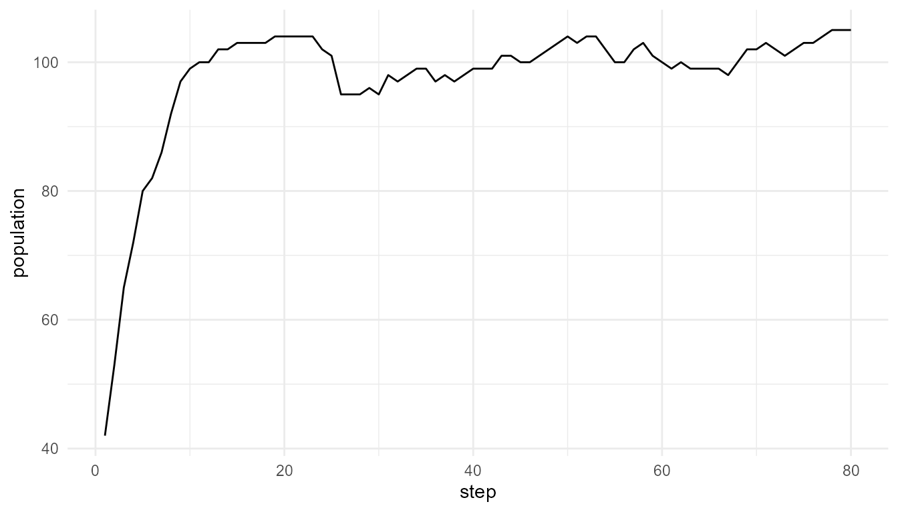
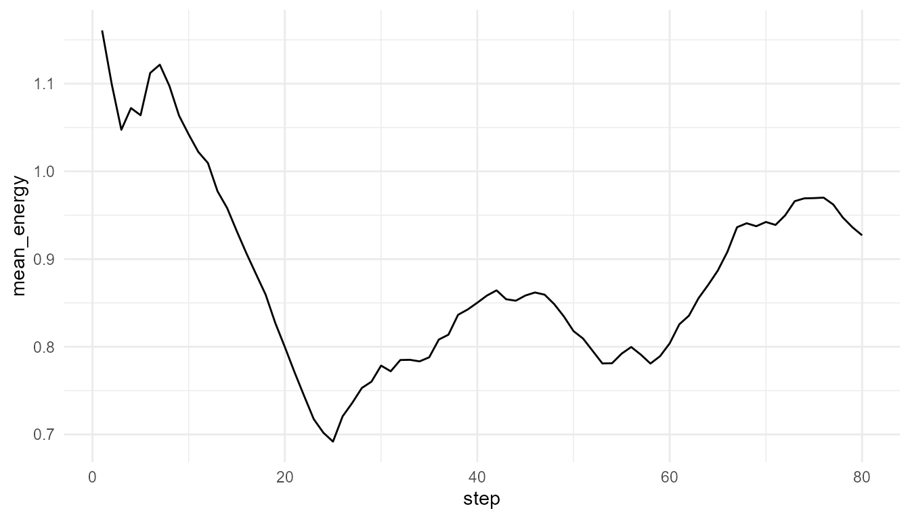

# Population Dynamics Tutorial

``` r
library(artificialLifeR)
```

## Purpose

This tutorial introduces
[`simulate_population_dynamics()`](https://noushinn.github.io/artificialLifeR/reference/simulate_population_dynamics.md).
Population dynamics are important in artificial life because individual
reproduction and death can produce population-level patterns over time.

In this tutorial, you will run a population simulation, plot population
size, compare resource levels, and interpret output carefully.

## Basic simulation

``` r
pop <- simulate_population_dynamics(
  initial_population = 40,
  steps = 80,
  carrying_capacity = 120,
  resource_level = 1.0,
  seed = 8
)

head(pop$summary)
#>   step population mean_energy mean_efficiency  trait_sd
#> 1    1         42    1.160712       0.5068640 0.1209392
#> 2    2         53    1.099529       0.5258282 0.1190282
#> 3    3         65    1.047416       0.5246034 0.1127533
#> 4    4         72    1.072170       0.5319397 0.1153829
#> 5    5         80    1.064019       0.5375708 0.1177924
#> 6    6         82    1.112263       0.5398442 0.1175034
```

## Plot population over time

``` r
plot_alife_sim(
  pop$summary,
  x = "step",
  y = "population",
  type = "line"
)
```



## Plot mean energy

``` r
plot_alife_sim(
  pop$summary,
  x = "step",
  y = "mean_energy",
  type = "line"
)
```



## Compare resource levels

``` r
low_resource <- simulate_population_dynamics(
  initial_population = 40,
  steps = 80,
  carrying_capacity = 120,
  resource_level = 0.5,
  seed = 8
)

high_resource <- simulate_population_dynamics(
  initial_population = 40,
  steps = 80,
  carrying_capacity = 120,
  resource_level = 1.5,
  seed = 8
)

data.frame(
  scenario = c("low resource", "high resource"),
  final_population = c(tail(low_resource$summary$population, 1), tail(high_resource$summary$population, 1)),
  final_mean_energy = c(tail(low_resource$summary$mean_energy, 1), tail(high_resource$summary$mean_energy, 1))
)
#>        scenario final_population final_mean_energy
#> 1  low resource               81         0.9149638
#> 2 high resource              111         0.9135949
```

## Measure trait change

``` r
measure_life_like_complexity(
  pop$agents,
  trait_col = "efficiency",
  time_col = "step"
)
#>      n unique_values  entropy      mean        sd temporal_variability
#> 1 7822            55 2.763371 0.6067738 0.1110611           0.04800829
#>   mean_abs_change
#> 1     0.002284226
```

## Compare carrying capacity

``` r
small_capacity <- simulate_population_dynamics(
  initial_population = 40,
  steps = 80,
  carrying_capacity = 60,
  resource_level = 1.0,
  seed = 8
)

large_capacity <- simulate_population_dynamics(
  initial_population = 40,
  steps = 80,
  carrying_capacity = 160,
  resource_level = 1.0,
  seed = 8
)

data.frame(
  scenario = c("small capacity", "large capacity"),
  final_population = c(tail(small_capacity$summary$population, 1), tail(large_capacity$summary$population, 1)),
  max_population = c(max(small_capacity$summary$population), max(large_capacity$summary$population))
)
#>         scenario final_population max_population
#> 1 small capacity               49             52
#> 2 large capacity              137            139
```

## Interpretation

Population dynamics emerge from repeated individual-level processes:
energy gain, energy cost, death, reproduction, inheritance, mutation,
and selection.

The population curve is not imposed directly. It arises from the
simulation rules.

## Suggested exercises

- Change `initial_population`.
- Change `carrying_capacity`.
- Increase or decrease `resource_level`.
- Change `mutation_rate`.
- Ask whether the population stabilizes, grows, or declines.

## Responsible interpretation

This is a simplified educational model. It does not replace ecological,
evolutionary, or demographic modeling. It illustrates how
population-level patterns can arise from individual-level rules.
