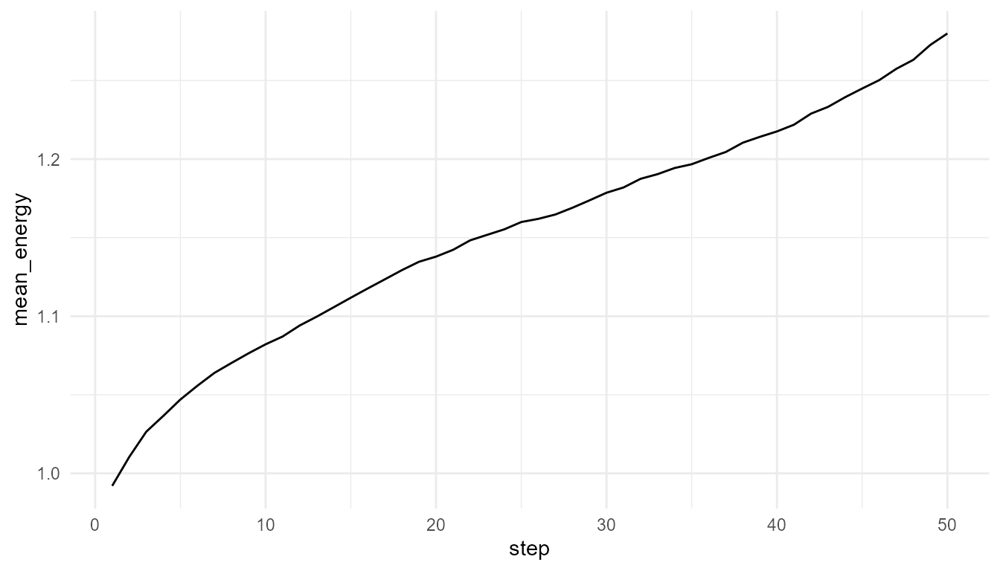
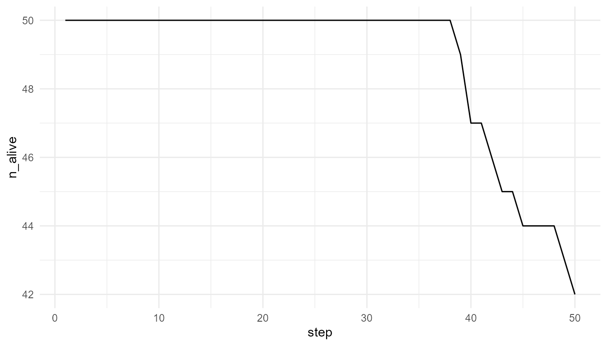

# Resource Competition Tutorial

``` r
library(artificialLifeR)
```

## Purpose

This tutorial introduces
[`simulate_resource_competition()`](https://noushinn.github.io/artificialLifeR/reference/simulate_resource_competition.md).
Resource competition is a core artificial-life idea because agents must
interact with an environment to maintain energy.

In this tutorial, you will run a competition simulation, inspect agent
and resource outputs, plot average energy, compare resource regeneration
settings, and interpret results carefully.

## Basic simulation

``` r
competition <- simulate_resource_competition(
  n_agents = 50,
  steps = 50,
  n_resources = 30,
  resource_regen = 0.20,
  seed = 2
)

names(competition)
#> [1] "agents"    "resources" "summary"
```

## Inspect outputs

``` r
head(competition$agents)
#>   agent         x           y    energy      speed efficiency
#> 1     1 0.2098611 0.074092349 0.9125861 0.07148919  0.5975891
#> 2     2 0.6856852 0.003262435 1.3371467 0.05521196  0.4830577
#> 3     3 0.5455454 0.717155232 0.9520106 0.04371456  0.5722192
#> 4     4 0.1354033 0.942352902 1.2122130 0.03500740  0.4155581
#> 5     5 0.9259978 0.247930549 0.8222090 0.03275603  0.6277294
#> 6     6 0.8847294 0.780429684 0.7198679 0.09096081  0.3656889
#>   reproduction_threshold age alive step
#> 1               1.529798   1  TRUE    1
#> 2               1.398045   1  TRUE    1
#> 3               1.787090   1  TRUE    1
#> 4               1.521871   1  TRUE    1
#> 5               1.403345   1  TRUE    1
#> 6               1.538384   1  TRUE    1
head(competition$resources)
#>   resource         x          y    amount step
#> 1        1 0.6920055 0.08084101 1.0000000    1
#> 2        2 0.5599569 0.95563857 0.5526803    1
#> 3        3 0.3426912 0.97326925 1.0000000    1
#> 4        4 0.2344975 0.14015762 0.3896781    1
#> 5        5 0.4296028 0.67780596 1.0000000    1
#> 6        6 0.7367007 0.79119735 0.6611856    1
head(competition$summary)
#>   step n_alive mean_energy mean_resource total_resource
#> 1    1      50   0.9920413     0.7355619       22.06686
#> 2    2      50   1.0104519     0.7045157       21.13547
#> 3    3      50   1.0265316     0.6795264       20.38579
#> 4    4      50   1.0365931     0.6723698       20.17109
#> 5    5      50   1.0469975     0.6577956       19.73387
#> 6    6      50   1.0557799     0.6461239       19.38372
```

The result is a list with:

| Object      | Meaning                                  |
|-------------|------------------------------------------|
| `agents`    | Agent states over time                   |
| `resources` | Resource locations and amounts over time |
| `summary`   | Population-level summary by time step    |

## Plot average energy

``` r
plot_alife_sim(
  competition$summary,
  x = "step",
  y = "mean_energy",
  type = "line"
)
```



## Plot number alive

``` r
plot_alife_sim(
  competition$summary,
  x = "step",
  y = "n_alive",
  type = "line"
)
```



## Compare resource regeneration

``` r
low_regen <- simulate_resource_competition(
  n_agents = 50,
  steps = 50,
  resource_regen = 0.05,
  seed = 2
)

high_regen <- simulate_resource_competition(
  n_agents = 50,
  steps = 50,
  resource_regen = 0.40,
  seed = 2
)

rbind(
  low_regen = measure_life_like_complexity(low_regen$agents, trait_col = "energy", time_col = "step"),
  high_regen = measure_life_like_complexity(high_regen$agents, trait_col = "energy", time_col = "step")
)
#>               n unique_values  entropy      mean        sd temporal_variability
#> low_regen  2500          2408 3.135088 0.7603476 0.4187126            0.1812062
#> high_regen 2500          2500 2.881435 1.4541690 0.5888900            0.2640396
#>            mean_abs_change
#> low_regen       0.01159387
#> high_regen      0.01842246
```

## Compare population summaries

``` r
data.frame(
  scenario = c("low regeneration", "high regeneration"),
  final_alive = c(tail(low_regen$summary$n_alive, 1), tail(high_regen$summary$n_alive, 1)),
  final_mean_energy = c(tail(low_regen$summary$mean_energy, 1), tail(high_regen$summary$mean_energy, 1)),
  final_total_resource = c(tail(low_regen$summary$total_resource, 1), tail(high_regen$summary$total_resource, 1))
)
#>            scenario final_alive final_mean_energy final_total_resource
#> 1  low regeneration          35         0.4671489              9.00000
#> 2 high regeneration          50         1.8947420             21.34703
```

## Interpretation

Resource regeneration changes environmental constraint. If resources
regenerate slowly, agents may lose energy or die. If resources
regenerate quickly, more agents may maintain energy.

This illustrates an artificial-life principle:

> Agent behavior cannot be understood separately from the environment.

## Suggested exercises

- Increase `movement_cost` and observe survival.
- Increase `n_agents` while keeping resources fixed.
- Change `consumption_rate` and compare average energy.
- Ask whether the environment is resource-rich or resource-limited.

## Responsible interpretation

This model illustrates resource competition in a simplified world. It is
not a full ecological model, but it helps users explore energy,
constraint, and agent-environment interaction.
