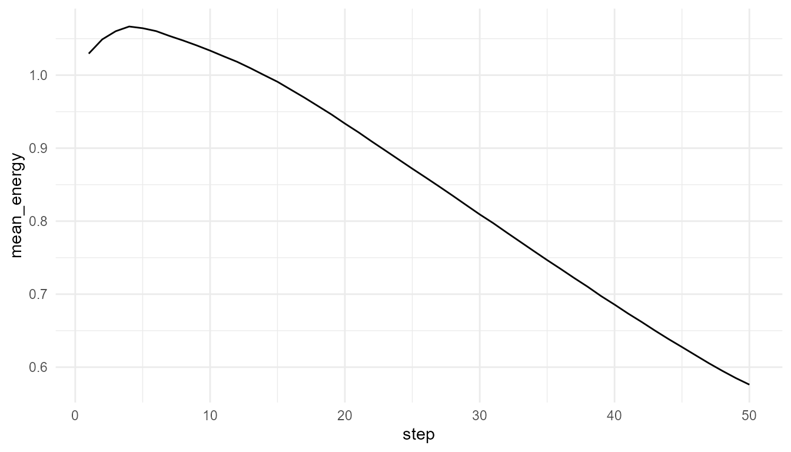
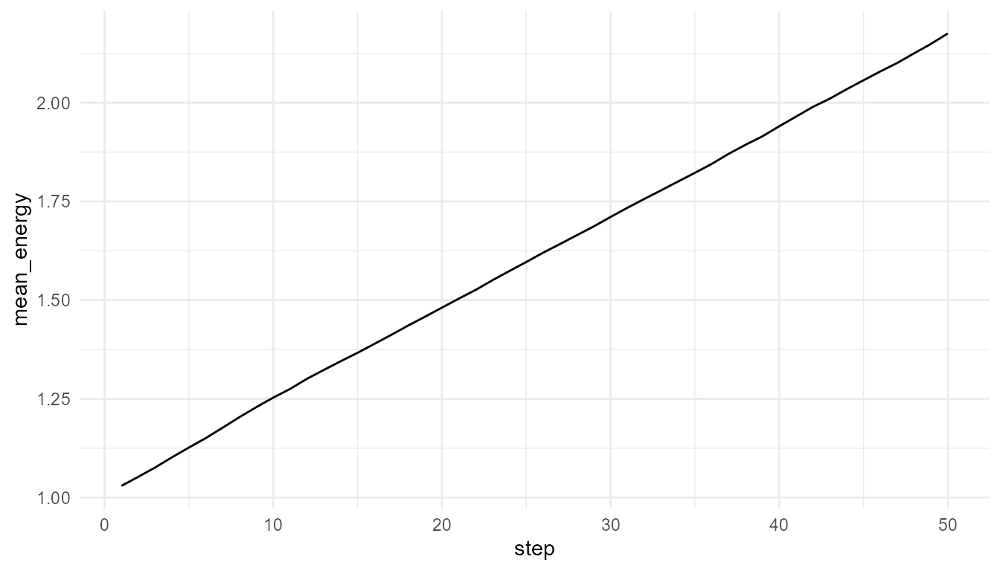
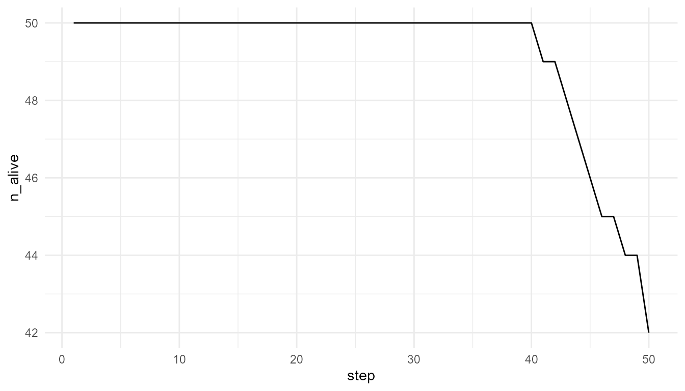
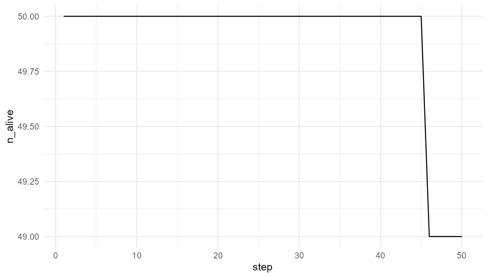

# Resources, Metabolism, and Constraint

``` r
library(artificialLifeR)
```

## Purpose

This article explains the role of resources, metabolism-like dynamics,
and constraint in artificial life. Living systems must maintain
themselves by interacting with energy and matter. Artificial-life models
simplify this idea by representing energy, resources, and costs
(Maturana and Varela 1980; Deacon 2011).

The purpose of this chapter is to show why life-like systems require
more than agents and rules. They also require limits, costs, resources,
and maintenance.

The guiding question is:

> Why does life-like behavior require constraint and energy-like
> accounting?

## Why resources matter

Resources are central to artificial life because they make survival
conditional. If agents could move, reproduce, and persist without cost,
the model would lose an important life-like feature: the need for
ongoing maintenance.

In biological systems, organisms require energy and matter to survive.
They must obtain resources, transform them, repair themselves, and
maintain organization over time.

In artificial-life models, this is usually simplified. Resources may be
represented as numeric values in an environment, and agents may have an
energy variable that increases or decreases depending on their actions.

This abstraction allows learners to explore a basic life-like principle:

> Persistence requires maintenance.

## Resources and survival

In artificial-life models, agents may gain energy by consuming resources
and lose energy through activity. This creates a basic survival
condition: an agent must maintain enough energy to persist.

For example:

- movement may reduce energy;
- resource consumption may increase energy;
- reproduction may require a minimum energy level;
- low energy may lead to death;
- scarce resources may reduce survival;
- abundant resources may support growth.

This creates a direct relationship between agent behavior and
environmental condition.

## Metabolism-like abstraction

The package does not model real metabolism. Instead, it uses a
metabolism-like abstraction.

In this abstraction:

- resources exist in the environment;
- agents consume resources;
- consumption increases energy;
- movement has a cost;
- reproduction may require energy;
- agents may die if energy becomes too low.

This captures the educational idea that life-like systems require
ongoing maintenance.

The word “metabolism-like” is important. The model does not simulate
biochemical pathways, enzymes, ATP, cellular respiration, or real
thermodynamics. It only represents the simplified logic that agents must
take in resources and spend energy to continue.

## Energy accounting

Energy accounting is useful because it makes trade-offs visible.

An agent cannot simply do everything without consequence. Movement may
help the agent reach resources, but movement can also cost energy.
Reproduction may increase population size, but it may require a minimum
energy threshold. Resource scarcity can make survival harder.

This creates model tension:

| Action or condition | Possible benefit | Possible cost or constraint |
|----|----|----|
| Movement | May help agents find resources | Can reduce energy |
| Resource consumption | Increases energy | Depends on availability |
| High speed | May improve search ability | May be costly in some models |
| Reproduction | Creates offspring | Requires sufficient energy |
| Resource scarcity | Creates selection-like pressure | Can reduce survival |
| Resource regeneration | Supports persistence | May limit or stabilize growth |

These trade-offs make the artificial-life system more dynamic.

## Constraint as productive

Constraint is not only limitation. It can structure behavior.

A resource-limited world forces agents into competition. Movement cost
makes speed beneficial in some contexts but costly in others.
Reproduction thresholds shape when offspring can appear. Carrying
capacity limits unlimited growth.

Artificial-life models often become interesting because of the tension
between possibility and constraint.

Without constraint, the model may become trivial. If resources are
unlimited and actions have no cost, then population growth or survival
may be too easy. Constraint creates pressure, and pressure makes
dynamics meaningful.

## Relation to the package

`artificialLifeR` includes resource and energy ideas in simplified form.

| Function | Resource or constraint idea |
|----|----|
| [`create_agents()`](https://noushinn.github.io/artificialLifeR/reference/create_agents.md) | Creates agents with traits such as energy, speed, or efficiency |
| [`simulate_resource_competition()`](https://noushinn.github.io/artificialLifeR/reference/simulate_resource_competition.md) | Shows how agents interact with limited resources |
| [`simulate_reproduction()`](https://noushinn.github.io/artificialLifeR/reference/simulate_reproduction.md) | Uses energy-like thresholds for reproduction |
| [`simulate_population_dynamics()`](https://noushinn.github.io/artificialLifeR/reference/simulate_population_dynamics.md) | Includes resource level and carrying capacity |
| [`measure_life_like_complexity()`](https://noushinn.github.io/artificialLifeR/reference/measure_life_like_complexity.md) | Can summarize variation in traits or energy-related outcomes |
| [`plot_alife_sim()`](https://noushinn.github.io/artificialLifeR/reference/plot_alife_sim.md) | Visualizes population or energy change over time |

These functions help learners explore how resource constraints shape
life-like dynamics.

## Example: resource-limited world

The following example compares two environments. One has low resource
regeneration, and the other has higher resource regeneration.

``` r
low_resource <- simulate_resource_competition(
  n_agents = 50,
  steps = 50,
  resource_regen = 0.05,
  seed = 3
)

high_resource <- simulate_resource_competition(
  n_agents = 50,
  steps = 50,
  resource_regen = 0.40,
  seed = 3
)

data.frame(
  scenario = c("low resource", "high resource"),
  final_alive = c(
    tail(low_resource$summary$n_alive, 1),
    tail(high_resource$summary$n_alive, 1)
  ),
  final_mean_energy = c(
    tail(low_resource$summary$mean_energy, 1),
    tail(high_resource$summary$mean_energy, 1)
  )
)
#>        scenario final_alive final_mean_energy
#> 1  low resource          42         0.5761335
#> 2 high resource          49         2.1753759
```

## Interpretation

Changing resource regeneration changes the environment. Agents do not
have the same outcomes under different resource constraints. This
illustrates why traits and behavior must be interpreted in context.

A careful interpretation is:

> The simulation shows how resource availability can influence survival
> and energy in a simplified artificial-life model.

An overstatement would be:

> The simulation fully models metabolism or ecology.

The first statement is appropriate. The second is too strong.

## Plot mean energy

``` r
plot_alife_sim(
  low_resource$summary,
  x = "step",
  y = "mean_energy",
  type = "line"
)
```



``` r

plot_alife_sim(
  high_resource$summary,
  x = "step",
  y = "mean_energy",
  type = "line"
)
```



## Interpretation of energy plots

The plots show how average energy changes over time in two simplified
environments. The comparison helps learners see that energy is not only
an agent property. It is shaped by the relationship between agents,
resources, costs, and environmental regeneration.

If the high-resource environment supports higher mean energy, this
suggests that resource regeneration affects agent maintenance. If the
difference is small, it may suggest that other model rules, such as
movement cost or competition, also matter.

## Plot survival

``` r
plot_alife_sim(
  low_resource$summary,
  x = "step",
  y = "n_alive",
  type = "line"
)
```



``` r

plot_alife_sim(
  high_resource$summary,
  x = "step",
  y = "n_alive",
  type = "line"
)
```



## Interpretation of survival plots

The number of living agents is a population-level outcome. It emerges
from individual energy changes, resource access, movement, and survival
rules.

A decline in `n_alive` may indicate that agents are not maintaining
enough energy. A stable or increasing value may indicate that resource
availability and model rules allow persistence.

However, the plot should not be interpreted as a full ecological
survival model. It is a simplified teaching example.

## Resource regeneration

The parameter `resource_regen` represents how quickly resources return
to the environment.

Low regeneration creates stronger constraint.  
High regeneration creates more opportunity for agents to maintain
energy.

``` r
regen_values <- c(0.02, 0.10, 0.30, 0.60)

regen_results <- lapply(regen_values, function(r) {
  sim <- simulate_resource_competition(
    n_agents = 50,
    steps = 50,
    resource_regen = r,
    seed = 10
  )

  data.frame(
    resource_regen = r,
    final_alive = tail(sim$summary$n_alive, 1),
    final_mean_energy = tail(sim$summary$mean_energy, 1)
  )
})

do.call(rbind, regen_results)
#>   resource_regen final_alive final_mean_energy
#> 1           0.02          39         0.2557759
#> 2           0.10          41         0.8351914
#> 3           0.30          46         1.6060503
#> 4           0.60          50         2.1626640
```

## Interpretation of regeneration comparison

This comparison shows how changing one environmental parameter can
change model outcomes.

The important lesson is not that one value is universally best. The
important lesson is that life-like dynamics depend on environmental
conditions. Agents, traits, and rules do not operate in isolation.

## Constraint and trait usefulness

A trait is useful only in context. For example, speed may help an agent
find resources, but it may also be costly. Efficiency may help an agent
convert resources into energy, but its advantage depends on how
resources are distributed and regenerated.

This means that traits should not be interpreted as universally good or
bad.

| Trait or property | May help when… | May matter less when… |
|----|----|----|
| Speed | Resources are spread out | Movement cost is high or resources are nearby |
| Efficiency | Resources are scarce | Resources are abundant |
| High energy | Reproduction requires energy | Reproduction is not active |
| Low reproduction threshold | Early reproduction is useful | Population pressure is high |
| Resource sensitivity | Environment changes over time | Environment is stable |

This is a key artificial-life lesson:

> Traits are meaningful in relation to constraints.

## Resources and reproduction

Resources are also important because they can affect reproduction. If
reproduction requires energy, then resource access indirectly shapes
population growth.

An agent that cannot maintain enough energy may fail to reproduce. An
agent that gains enough energy may produce offspring. This connects
individual resource use to population-level continuity.

| Level              | Example                            |
|--------------------|------------------------------------|
| Environment        | Resource availability              |
| Agent state        | Energy level                       |
| Rule               | Reproduce if energy is high enough |
| Population outcome | Growth, decline, or stability      |

This link is one reason resource models are central to artificial life.

## Relation to origin of life

Origin-of-life research often asks how early systems maintained
organization under physical and chemical constraints (Kauffman 1993;
Maynard Smith and Szathmáry 1999).

Resource and energy flow are central to that question. A life-like
system cannot simply exist as a static object. It must maintain
organization over time despite degradation, noise, and environmental
change.

The model here is not prebiotic chemistry. It does not simulate real
molecules, membranes, hydrothermal vents, metabolism-first theories, or
RNA-world chemistry. However, it helps learners understand why
self-maintenance and constraint are central to life-like organization.

## Relation to autopoiesis and self-maintenance

Some theories of life emphasize self-maintenance and organization. In
this view, living systems are not only collections of parts. They are
organized systems that continuously produce and maintain their own
structure (Maturana and Varela 1980).

`artificialLifeR` does not model autopoiesis in a full theoretical or
biological sense. However, its resource and energy abstractions can help
introduce the idea that life-like systems require ongoing maintenance.

A careful interpretation is:

> The model illustrates a simplified maintenance problem.

not:

> The model fully represents autopoiesis.

## What the model captures

The resource model captures several important ideas:

- agents require energy-like resources;
- actions can have costs;
- environments can be more or less supportive;
- resource limits can create competition;
- survival depends on ongoing maintenance;
- population-level outcomes depend on environmental constraint;
- traits are meaningful only in context.

These ideas are central to artificial-life modelling.

## What the model does not capture

The model is intentionally simplified. It does not include:

- real metabolism;
- biochemical pathways;
- cellular respiration;
- thermodynamic details;
- molecular self-maintenance;
- real ecological food webs;
- organismal physiology;
- nutrient cycles;
- real prebiotic chemistry.

It is a toy model for conceptual exploration.

## Responsible interpretation

It is better to say:

> The model illustrates simplified resource and energy-like constraints.

than:

> The model simulates real metabolism.

It is better to say:

> Resource availability can influence survival and population-level
> outcomes.

than:

> The model explains biological ecology.

It is better to say:

> The model helps learners think about maintenance and constraint.

than:

> The model proves how life maintains itself.

Careful language preserves the educational value of the simulation.

## Educational use

This chapter can support several classroom or self-study questions:

- Why do artificial-life systems need resources?
- What does energy represent in a toy model?
- How does resource regeneration affect survival?
- Why are costs important?
- Why are traits context-dependent?
- How do environmental constraints shape population outcomes?
- What is missing from the model compared with real metabolism?
- How does resource use connect to origin-of-life questions?

These questions help learners understand why life-like behaviour
requires more than movement and reproduction. It also requires
maintenance under constraint.

## Key takeaway

Resources and constraints make artificial-life models dynamic. They
create conditions under which agents can persist, fail, reproduce, or
change population-level patterns.

`artificialLifeR` uses simplified resource and energy-like variables to
make the logic of maintenance visible. The package does not model real
metabolism, but it helps learners understand why self-maintenance, cost,
and constraint are central to life-like organization.

## References

Deacon, Terrence W. 2011. *Incomplete Nature: How Mind Emerged from
Matter*. W. W. Norton.

Kauffman, Stuart A. 1993. *The Origins of Order: Self-Organization and
Selection in Evolution*. Oxford University Press.

Maturana, Humberto R., and Francisco J. Varela. 1980. *Autopoiesis and
Cognition: The Realization of the Living*. D. Reidel.

Maynard Smith, John, and Eörs Szathmáry. 1999. *The Origins of Life:
From the Birth of Life to the Origin of Language*. Oxford University
Press.
