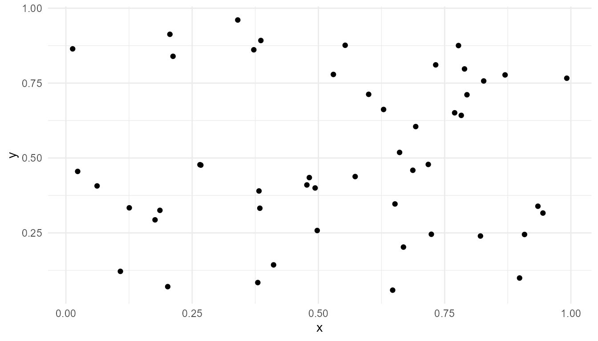

# What Is Artificial Life?

``` r
library(artificialLifeR)
```

## Purpose

This article introduces the conceptual foundation of `artificialLifeR`.
Artificial life studies life-like organization using artificial systems,
computational models, simulations, robotics, and theoretical frameworks
(Langton 1989; Bedau 2003).

The package does not attempt to define life once and for all. Instead,
it provides simplified simulations that help learners explore how
agents, resources, reproduction, mutation, selection, and population
dynamics can generate life-like patterns.

The guiding question is:

> What can simplified artificial systems teach us about life-like
> organization?

## What is artificial life?

Artificial life is a field that studies life-like processes in
artificial systems. These systems may be computer simulations,
mathematical models, digital organisms, robots, chemical models, or
theoretical frameworks.

Rather than studying only existing biological organisms, artificial life
asks broader questions:

- What makes a system life-like?
- How can organization arise from simpler parts?
- How do agents interact with environments?
- How do reproduction, mutation, and selection shape populations?
- How can local rules generate system-level patterns?
- What is the difference between being life-like and being alive?

Artificial life is therefore both scientific and philosophical. It helps
learners think about life as a process, not only as a category.

## Artificial life as a bottom-up field

Artificial life often studies life from the bottom up. Instead of
beginning with a complete organism, it begins with simpler units and
rules. Researchers then examine whether population-level or system-level
organization can arise.

This bottom-up approach is useful because many living systems depend on
interactions among parts. A living cell is not explained only by listing
its molecules. A population is not explained only by listing organisms.
Organization matters.

Artificial-life models therefore ask how life-like properties may arise
from:

- local interaction;
- energy or resource constraints;
- reproduction;
- variation;
- inheritance;
- selection;
- adaptation;
- system-level feedback.

The main idea is:

> Life-like organization may arise from interacting processes, not from
> isolated parts alone.

## Life-like does not mean alive

A central distinction is between a system that is **life-like** and a
system that is **alive**.

A simulation may be life-like if it shows simplified properties such as
reproduction, variation, competition, adaptation, or population change.
But this does not mean the simulation is biologically alive.

This distinction is important for responsible interpretation.
`artificialLifeR` creates educational models of life-like processes. It
does not create life.

A careful statement is:

> The package illustrates simplified life-like dynamics.

An overstatement would be:

> The package creates living systems.

The first statement is appropriate. The second is not.

## Why use simulations?

Simulations are useful because they make assumptions visible. In a
simulation, learners can change parameters and observe how the system
responds.

For example, users can ask:

- What happens if resources become scarce?
- What happens if mutation rate increases?
- What happens if only some agents survive?
- What happens if carrying capacity changes?
- What happens when reproduction requires energy?

This makes artificial life useful for teaching. A simulation does not
need to be fully realistic to be educational. A good toy model can
isolate one idea and make it easier to understand.

## Core concepts in artificial life

`artificialLifeR` focuses on several core artificial-life concepts.

| Concept | Meaning |
|----|----|
| Agents | Simplified individuals or units in a model |
| Environment | The space or conditions in which agents act |
| Resources | Energy-like quantities that support survival or reproduction |
| Reproduction | Creation of new agents |
| Inheritance | Transmission of traits from parent to offspring |
| Mutation | Random variation in traits |
| Selection | Differential persistence or reproduction |
| Population dynamics | Change in population size or composition over time |
| Emergence | System-level patterns arising from local rules |

These concepts are connected. Artificial-life dynamics usually become
interesting when several of them interact.

## Relation to the package

`artificialLifeR` provides simplified functions for exploring these
concepts.

| Function | Conceptual role |
|----|----|
| [`create_agents()`](https://noushinn.github.io/artificialLifeR/reference/create_agents.md) | Creates artificial individuals with traits and energy |
| [`simulate_resource_competition()`](https://noushinn.github.io/artificialLifeR/reference/simulate_resource_competition.md) | Models agents interacting with resource constraints |
| [`simulate_reproduction()`](https://noushinn.github.io/artificialLifeR/reference/simulate_reproduction.md) | Models simplified reproduction and inheritance |
| [`simulate_mutation()`](https://noushinn.github.io/artificialLifeR/reference/simulate_mutation.md) | Introduces trait variation |
| [`simulate_selection()`](https://noushinn.github.io/artificialLifeR/reference/simulate_selection.md) | Models differential persistence based on fitness-like scores |
| [`simulate_population_dynamics()`](https://noushinn.github.io/artificialLifeR/reference/simulate_population_dynamics.md) | Shows population-level change over time |
| [`measure_life_like_complexity()`](https://noushinn.github.io/artificialLifeR/reference/measure_life_like_complexity.md) | Provides simple summaries of diversity and change |
| [`plot_alife_sim()`](https://noushinn.github.io/artificialLifeR/reference/plot_alife_sim.md) | Visualizes artificial-life outputs |

These functions are intentionally simple. Their purpose is not to
replace detailed biological models. Their purpose is to make
artificial-life concepts visible and teachable.

## Minimal example

The simplest starting point is a population of artificial agents.

``` r
agents <- create_agents(
  n_agents = 50,
  seed = 1
)

head(agents)
#>   agent         x          y    energy      speed efficiency
#> 1     1 0.2655087 0.47761962 1.0597159 0.03759267  0.5450187
#> 2     2 0.3721239 0.86120948 0.9081960 0.05084232  0.4981440
#> 3     3 0.5728534 0.43809711 1.0511680 0.03178157  0.4681932
#> 4     4 0.9082078 0.24479728 0.8305955 0.05316058  0.4070638
#> 5     5 0.2016819 0.07067905 1.2149536 0.03690831  0.3512540
#> 6     6 0.8983897 0.09946616 1.2970600 0.08534575  0.3924808
#>   reproduction_threshold age alive
#> 1               1.540940   0  TRUE
#> 2               1.668887   0  TRUE
#> 3               1.658659   0  TRUE
#> 4               1.466909   0  TRUE
#> 5               1.271476   0  TRUE
#> 6               1.749766   0  TRUE
```

## Visualize the agents

``` r
plot_alife_sim(
  agents,
  x = "x",
  y = "y",
  type = "point"
)
```



## Interpretation

The agents have positions, energy, and traits. These traits do not make
the agents alive. They create a simplified population in which life-like
processes can be explored.

A careful interpretation is:

> This output shows a simulated population of artificial agents.

An overstatement would be:

> This output shows real organisms.

The model is useful because it gives learners a starting point for
exploring how agent traits and environmental rules can produce
population-level outcomes.

## Artificial life and emergence

Artificial life is closely related to emergence. In many artificial-life
models, system-level behavior arises from local interactions among
agents and environments (Holland 1998; Mitchell 2009).

For example:

- population growth can arise from individual reproduction;
- adaptation-like patterns can arise when variation and selection
  operate together;
- resource competition can produce survival differences without a
  central controller;
- trait distributions can shift over time through repeated local events.

The system-level pattern is not usually programmed directly. Instead, it
develops through the repeated application of model rules.

This is why artificial life is useful for studying emergence:

> It shows how simple rules can generate organized patterns over time.

## Artificial life and origin-of-life thinking

Artificial life is also relevant to origin-of-life questions.
Origin-of-life research asks how non-living chemical systems may have
become organized, self-maintaining, and evolvable.

`artificialLifeR` does not simulate real prebiotic chemistry. It does
not model real molecules, membranes, RNA, metabolism, or laboratory
chemistry.

However, it can help learners think about abstract ingredients of
life-like organization, such as:

- persistence;
- reproduction;
- variation;
- selection;
- resource use;
- environmental constraint;
- population-level change.

This makes the package a conceptual tool, not a complete origin-of-life
model.

## Artificial life and consciousness

Artificial life can sometimes overlap with discussions of cognition and
consciousness because it involves agents, environments, behaviour, and
adaptation.

However, life-like behaviour is not the same as consciousness. A
simulated population may reproduce, mutate, or adapt without having
awareness or subjective experience.

`artificialLifeR` does not model consciousness. It does not detect,
measure, or create awareness.

A careful statement is:

> Artificial-life models can inform discussions of agency, adaptation,
> and organization.

An overstatement would be:

> Artificial-life models show that artificial agents are conscious.

This distinction is important for responsible interpretation.

## What the package captures

The package captures several important artificial-life ideas:

- agents can vary in traits;
- environments can impose constraints;
- resources can affect survival;
- reproduction can transmit traits;
- mutation can introduce novelty;
- selection can change population composition;
- population-level patterns can emerge over time;
- simple rules can produce complex-looking outcomes.

These ideas make the package useful for teaching and conceptual
exploration.

## What the package does not capture

The package is intentionally simplified. It does not model:

- real genetics;
- real metabolism;
- biochemical networks;
- development;
- ecological realism;
- consciousness;
- subjective experience;
- full biological evolution;
- real origin-of-life chemistry.

The models are toy models. Their value lies in clarity, not realism.

## Responsible interpretation

It is better to say:

> The model illustrates life-like dynamics.

than:

> The model creates life.

It is better to say:

> The simulation shows simplified reproduction, mutation, or
> selection-like processes.

than:

> The simulation fully models biological evolution.

It is better to say:

> The package helps learners explore artificial-life concepts.

than:

> The package proves how life began.

Responsible interpretation keeps the package academically credible.

## Educational use

This chapter can support several classroom or self-study questions:

- What is artificial life?
- What does it mean for a system to be life-like?
- Why are agents and environments important?
- Why do resources and constraints matter?
- How do reproduction and mutation affect populations?
- How is selection different from adaptation?
- What is emergence?
- What are the limits of toy models?

These questions help learners use the package as a conceptual toolkit.

## Key takeaway

Artificial life uses artificial systems to explore life-like
organization. `artificialLifeR` provides simplified educational
simulations that make core ideas visible: agents, environments,
resources, reproduction, mutation, selection, and population dynamics.

The package does not create life or fully model biology. Its strength is
conceptual clarity. It helps users explore how life-like patterns can
arise from simple rules while preserving the distinction between toy
models and real living systems.

## References

Bedau, Mark A. 2003. “Artificial Life: Organization, Adaptation and
Complexity from the Bottom Up.” *Trends in Cognitive Sciences* 7 (11):
505–12.

Holland, John H. 1998. *Emergence: From Chaos to Order*. Oxford
University Press.

Langton, Christopher G. 1989. “Artificial Life.” In *Artificial Life*,
edited by Christopher G. Langton, 1–47. Addison-Wesley.

Mitchell, Melanie. 2009. *Complexity: A Guided Tour*. Oxford University
Press.
